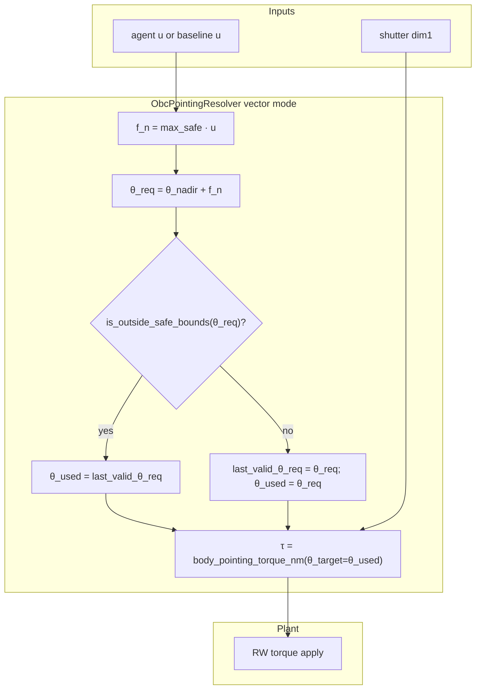

# Exp 4 vector pointing fix (promote-ready)

## Problem statement

Ref1 (`attitude_request_mode=vector`) requires dim0 = **u ∈ [-1,1]** (normalized), mapped to nadir-relative offset **f_n** then `θ_req = θ_nadir + f_n` → PD → τ. Warmup uses the baseline overflight policy, which today only exports **τ** ([`baseline_overflight_step.py`](backend/autonomous_control/baseline_overflight_step.py) + [`episode_runner.py`](backend/autonomous_control/episode_runner.py) L493). The overnight crash fix (torque passthrough) is **invalid science**; pipeline exp4 completion on that run must be treated as **void for ref1**.

## Design contract (v1 — freeze in docs before code)

### Nadir-relative command

**Policy / gym dim0:** `u ∈ [-1, 1]` (unitless).

**Nadir-relative offset (rad):**

```text
f_n = max_safe · u        # max_safe > 0  ⇒  f_n ∈ [-max_safe, max_safe]
θ_req = wrap_pi(θ_nadir + f_n)
```

| Symbol | Definition (code-aligned) |
|--------|---------------------------|
| `θ_orbit` | `ctrl_state.theta_orbit_rad` |
| `θ_nadir` | `nadir_target_angle_rad(θ_orbit)` — anti-radial in disk frame ([`attitude_controller.py`](backend/simulation/attitude_controller.py) L122–123) |
| `u` | dim0 ∈ [-1, 1]; **u = 0 → f_n = 0 → nadir** |
| `max_safe` | **`OFF_NADIR_HARD_LIMIT_DEG` (45°)** from [`ATTITUDE_SAFETY.py`](backend/environment_definition/constants/ATTITUDE_SAFETY.py) — **same constant** as torque-mode `AttitudeSafetyController.config.off_nadir_hard_limit` ([`attitude_controller.py`](backend/simulation/attitude_controller.py)); not a separate experiment-only 40° span |
| `f_n` | Signed nadir-relative offset [rad]; the **pointing vector command** OBC consumes |
| `θ_req` | Absolute in-plane boresight target angle [rad] |

**Constant source (locked):** import `max_safe` from `environment_definition.constants.ATTITUDE_SAFETY.OFF_NADIR_HARD_LIMIT_DEG` (pint → rad at use site). Drop experiment-only `THETA_MAX_COMMAND` (40°) for command scaling — one shared limit for torque-path safe mode and vector-path `f_n` span.

**Inverse (baseline → u):** `f_n_target = wrap_pi(θ_target − θ_nadir)`; `u = clip(f_n_target / max_safe, −1, 1)`.

**Locked decision (user):** hold-last when geometric off-nadir at `θ_req` **≥ `max_safe`** (same 45° constant) — command span and safety threshold aligned.

### OBC vector path (replaces clamp-with-projection)



- **`is_outside_safe_bounds(θ_req)`:** `body_boresight_off_nadir_rad(θ_req, sat_xy) >= max_safe_rad` where `max_safe_rad` is **`OFF_NADIR_HARD_LIMIT_DEG`** — same threshold as torque-path safe-mode entry ([`attitude_controller.py`](backend/simulation/attitude_controller.py) L504–513). **Hold-last** (no clamp projection).
- **`last_valid_θ_req` init:** `θ_nadir` at episode reset (equivalent to **u = 0**, nadir hold on tangential plane when requests go bad).
- **Diagnostics:** replace/extend `reference_clamp_count` with `hold_last_count`; keep `last_u`, `last_theta_req_rad`, `last_theta_used_rad`, `last_off_nadir_rad`.
- **Torque mode (ref0):** unchanged — dim0 = τ/τ_max through production `AttitudeSafetyController` ([`stepper.py`](backend/simulation/stepper.py) L435–437); no hold-last chain.

### Baseline (vector mode)

Extract pointing reference from existing baseline PD target logic ([`baseline_overflight.py`](backend/notebooks/s01/s01_utils/baseline_overflight.py) `compute_torque_request_nm` L358–383):

1. **`baseline_theta_target_rad(policy, state, sat_xy)`** — nadir phase → `nadir_target_angle_rad`; engage → `target_boresight_angle_rad`.
2. **`theta_target_to_u(θ_target, θ_orbit, max_safe)`** — `f_n = wrap(θ_target − θ_nadir)`; `u = clip(f_n / max_safe, −1, 1)`.
3. **Vector warmup:** compute `u_baseline`, pass through **same** `ObcPointingResolver` as the agent (no `compute_torque_request_nm`, no torque passthrough).
4. **Torque warmup:** keep `compute_torque_request_nm` → τ.

### Episode integration (fork patches)

[`_episode_runner_fork.py`](backend/scripts/experiments/ml_agent_reference_pointing/_episode_runner_fork.py) stays a thin adapter:

| Patch target | Why |
|--------------|-----|
| `episode_runner.baseline_overflight_controller_tick` | Direct import binding in [`episode_runner.py`](backend/autonomous_control/episode_runner.py) L35 — module-level patch alone is insufficient (learned from failed attempt) |
| `episode_runner.policy_output_to_gym_action` | Agent `u` → `last_stored` |
| `SimulationStepper.step` | Vector: resolve u → τ, bypass torque-path safety (existing pattern) |
| `EpisodeRunner.run_serial` | Per-episode `ObcPointingResolver` context |

Remove/replace partial WIP [`_baseline_vector_command.py`](backend/scripts/experiments/ml_agent_reference_pointing/_baseline_vector_command.py) and torque-passthrough branch.

---

## Implementation phases

### Phase A — Spec + pipeline (no training)

1. Move [`04-agent-reference-pointing.md`](docs/experiments/pipeline/0-initialized/04-agent-reference-pointing.md) → **`1-built/`**; set `current_phase: 1`, phase 0 `done`, phase 1 `in_progress`; update [`pipeline/README.md`](docs/experiments/pipeline/README.md).
2. Update vector semantics in [`H1-agent-reference.md`](backend/scripts/experiments/ml_agent_reference_pointing/H1-agent-reference.md) § Vector semantics: hold-last, baseline `u`, invalidate prior runs.
3. `/document-experiment-step` Phase 1 block when build is complete (not before smoke passes).

### Phase B — Promote-shaped experiment modules (fork only)

Refactor under [`ml_agent_reference_pointing/`](backend/scripts/experiments/ml_agent_reference_pointing/) so production promotion is mostly **move + delete monkeypatch**, not rewrite:

| New/refactored module | Responsibility |
|-----------------------|----------------|
| `_nadir_relative_pointing.py` | `u_to_fn`, `fn_to_theta_req`, `theta_target_to_u`, `is_outside_safe_bounds`; `max_safe` constant |
| `_obc_pointing_resolver.py` | `ObcPointingResolver` (hold-last state, `resolve_u_to_torque_nm`, diagnostics); extract from `_obc_attitude_request_fork.py` |
| `_baseline_pointing.py` | `baseline_pointing_u(...)` wrapping policy target extraction |
| `_episode_runner_fork.py` | Patches only; delegates to resolver |
| `_action_adapter_fork.py` | Unchanged role (policy dim0 = u in vector mode) |

**Promotion target (document now, implement later):** `backend/simulation/obc_pointing_request.py` + `SimulationConfig.attitude_request_mode: Literal["torque","vector"]` + stepper branch — mirror the experiment API 1:1.

### Phase C — Tests (required before re-run)

Add focused tests under `backend/tests/` (preferred for promote path) or `ml_agent_reference_pointing/tests/`:

- `u=0` → `f_n=0` → `θ_req == θ_nadir`
- `u=±1` → `f_n = ±max_safe`
- `|u|>1` clipped at adapter boundary
- OOB `θ_req` (≥45° off-nadir) → hold-last (count increments, `θ_used` unchanged)
- In-bounds request updates `last_valid`
- Episode reset → `last_valid = θ_nadir`
- Baseline `u` matches `theta_target_to_u` from mocked policy phase (nadir + engage)

No full episode training in unit tests.

### Phase D — Smoke + invalidation

```powershell
conda activate auto-sat
cd backend/scripts/experiments/ml_agent_reference_pointing
python run_agent_reference.py --smoke                    # ref0 torque
python run_agent_reference.py --arms ref1 --train-episodes 1 --trim-artifacts  # ref1 vector warmup+1 train
```

- Delete/invalidate ref1 warmup bundle cache (fingerprint includes `attitude_request_mode` via [`_warmup_fingerprint_patch`](backend/scripts/experiments/ml_agent_reference_pointing/_warmup_fingerprint_patch.py)).
- Mark prior `results/agent_reference.json` and pipeline exp4 row as **invalid_run** in Phase 2 doc (do not use for H4 verdict).

### Phase E — Full Exp 4 re-run

- Mutex clear → `run_agent_reference.py --arms ref0,ref1 --show-progress` (learnable protocol: 50 ep if aligned with pipeline).
- Export videos per [experiment-visual-evidence](.cursor/rules/experiment-visual-evidence.mdc); frame-inspect before Phase 3 verdict language.
- **Hold analysis** on exp3/5/6 until exp4 is valid (per your direction).

### Phase F — Promotion slice (after solid experiment + verdict)

Gate: H4 **supported** (or partial with explicit promote scope) + user visual sign-off ([`minimal-feature-review`](.cursor/skills/minimal-feature-review/SKILL.md)).

| Layer | Change |
|-------|--------|
| `simulation/obc_pointing_request.py` | Move `ObcPointingResolver` + nadir-relative helpers (pint units on angles) |
| `simulation/stepper.py` | Accept pointing mode; vector path applies resolver before RW plant |
| `autonomous_control/action_adapter.py` | Optional `attitude_request_mode` on parse (or config-driven) |
| `autonomous_control/episode_runner.py` | Baseline vector warmup calls `baseline_pointing_u` when mode=vector (no fork patch) |
| `docs/presentation/technical-constants.md` | OBC vector mode: `f_n = max_safe·u`, `max_safe = OFF_NADIR_HARD_LIMIT_DEG`, hold-last at same limit |
| `docs/presentation/machine-learning.md` | dim0 semantics per mode |
| Experiment fork | Thin wrapper or delete patches; re-run smoke to prove parity |

Record promotion decision in Exp 4 Phase 4.1 + [`DECISIONS.md`](docs/research/DECISIONS.md).

---

## Success criteria

| Gate | Criterion |
|------|-----------|
| Build | ref1 smoke passes warmup without `stored_action` error |
| Semantics | Warmup and train both log non-null `last_u`; vector path never applies raw baseline τ |
| Science | ref0/ref1 comparable except dim0 semantics; ref1 `safe_mode_takeover_count ≈ 0` |
| Promote readiness | Resolver + nadir helpers in test-covered module with stable public API |
| Invalidation | Prior pipeline exp4 ref1 results excluded from verdict |

---

## Out of scope (this plan)

- Re-analysis of exp3/5/6 (on hold)
- Ref2 MPO vector arm
- MPC/QP pointing
- Changing `OFF_NADIR_HARD_LIMIT_DEG` without doc + presentation update (torque and vector modes share it)
- Reintroducing a separate 40° experiment-only command span (`THETA_MAX_COMMAND`)
