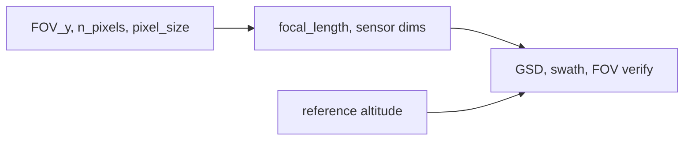

# Working secondary camera notebook cell

## Goal

Replace the broken cell in [`backend/notebooks/experiments/s01_run.ipynb`](backend/notebooks/experiments/s01_run.ipynb) with code that matches your sketch:

- GoPro-style secondary camera (70° vertical FOV, 5312×2988)
- Mount tilt (`TILT_ANGLE_SCND`, off nadir)
- **FOV is primary** → derive `focal_length`; **report** GSD at reference altitude (not drive optics from GSD)

No simulation wiring yet — this unblocks design/exploration in the notebook only.

## Constraint resolution (FOV-primary)



Formulas (reuse existing [`backend/simulation/camera_optics.py`](backend/simulation/camera_optics.py)):

- `sensor_height = n_pixels_y * pixel_size`
- `focal_length = sensor_height / (2 * tan(fov_y / 2))`  — inverse of `pinhole_full_fov_rad`
- `gsd = pixel_size * altitude / focal_length` via `nadir_ground_sample_distance`
- `swath_y = n_pixels_y * gsd`

**Anchor required:** pixel pitch (not in your sketch). Use GoPro action-cam educated guess **`1.55 µm`** with a comment that it is a placeholder until a datasheet value is fixed.

## Code to add

### 1. `CameraImage` (new file)

Add [`backend/simulation/camera_image.py`](backend/simulation/camera_image.py):

```python
@dataclass(frozen=True)
class CameraImage:
    focal_length: Quantity
    pixel_size: Quantity
    n_pixels_x: int
    n_pixels_y: int

    def sensor_width(self) -> Quantity: ...
    def sensor_height(self) -> Quantity: ...
    def fov(self, *, axis: Literal["x", "y"]) -> Quantity: ...   # wraps pinhole_full_fov_rad
    def gsd_at(self, altitude: Quantity) -> Quantity: ...
    def swath_at(self, altitude: Quantity, *, axis: Literal["x", "y"]) -> Quantity: ...

    @classmethod
    def from_hardware(cls, *, focal_length, pixel_size, n_pixels_x, n_pixels_y): ...

    @classmethod
    def from_fov(
        cls, *, fov_y, pixel_size, n_pixels_x, n_pixels_y,
        axis: Literal["x", "y"] = "y",
    ): ...  # solves focal_length from FOV + sensor dim on chosen axis
```

Also add a small mount wrapper (same file):

```python
@dataclass(frozen=True)
class CameraMount:
    camera: CameraImage
    tilt_off_nadir: Quantity   # 0 deg = nadir in your sketch
```

Export `DEFAULT_NADIR_CAMERA = CameraImage.from_hardware(...)` built from current [`SATELLITE.py`](backend/environment_definition/constants/SATELLITE.py) values (for future use; not wired into sim in this slice).

### 2. Tests (TDD first)

Add [`backend/tests/test_camera_image.py`](backend/tests/test_camera_image.py):

- `from_hardware` round-trip: GSD @ 500 km ≈ 1.5 m (matches existing [`test_camera_optics_2d.py`](backend/tests/test_camera_optics_2d.py))
- `from_fov`: 70° + 2988 px + 1.55 µm → focal length positive; `camera.fov(axis="y")` ≈ 70°
- `gsd_at` and `swath_at` return pint quantities in metres

### 3. Notebook cell (replace cell 5)

Working cell content:

```python
from dataclasses import dataclass
from environment_definition.constants.SATELLITE import CAMERA_ALTITUDE
from environment_definition.constants.UNIT_REGISTRY import UREG as ureg
from simulation.camera_image import CameraImage, CameraMount

# Secondary forward-looking camera (GoPro 4K+ mental model)
TILT_ANGLE_SCND = 0 * ureg.deg
FOV_ANGLE_SCND = 70 * ureg.deg
N_PIXELS_SCND_X = 5312
N_PIXELS_SCND_Y = 2988
PIXEL_SIZE_SCND = 1.55 * ureg.um  # educated guess; TBD from datasheet

scnd_camera = CameraImage.from_fov(
    fov_y=FOV_ANGLE_SCND,
    pixel_size=PIXEL_SIZE_SCND,
    n_pixels_x=N_PIXELS_SCND_X,
    n_pixels_y=N_PIXELS_SCND_Y,
)
scnd_mount = CameraMount(camera=scnd_camera, tilt_off_nadir=TILT_ANGLE_SCND)

ref_altitude = SATELLITE_ALTITUDE  # mission reference from setup cell, fallback CAMERA_ALTITUDE
gsd = scnd_camera.gsd_at(ref_altitude)
swath_y = scnd_camera.swath_at(ref_altitude, axis="y")
swath_x = scnd_camera.swath_at(ref_altitude, axis="x")

print(f"Secondary camera (GoPro-style)")
print(f"  mount tilt off nadir: {scnd_mount.tilt_off_nadir.to('deg'):~}")
print(f"  focal length:         {scnd_camera.focal_length.to('mm'):~}")
print(f"  pixel pitch:          {scnd_camera.pixel_size.to('um'):~}")
print(f"  resolution:           {scnd_camera.n_pixels_x} x {scnd_camera.n_pixels_y}")
print(f"  FOV (y / x):          {scnd_camera.fov(axis='y').to('deg'):~} / {scnd_camera.fov(axis='x').to('deg'):~}")
print(f"  GSD @ {ref_altitude.to('km'):~}:           {gsd.to('m'):~}")
print(f"  swath (y / x):        {swath_y.to('km'):~} / {swath_x.to('km'):~}")
```

Notes:
- Fix broken imports (`backend.environment_definition...` → `environment_definition...`)
- Use `SATELLITE_ALTITUDE` from setup cell when available (sampled mission altitude); fall back to `CAMERA_ALTITUDE` constant
- No `Camera2d` / `some_function` placeholders

## Out of scope (follow-up slices)

- Passing `scnd_camera` into [`camera_2d.simulate_camera_strip_2d`](backend/simulation/camera_2d.py) / [`SimulationStepper`](backend/simulation/stepper.py)
- Fisheye distortion model (plan stays **pinhole**; 70° FOV is wide but still pinhole math)
- Updating `docs/presentation/technical-constants.md` (defer until pixel pitch is confirmed)

## Verification

1. `pytest backend/tests/test_camera_image.py`
2. Run notebook cell 5 — prints focal length, FOV, GSD, swath with pint units, no errors
