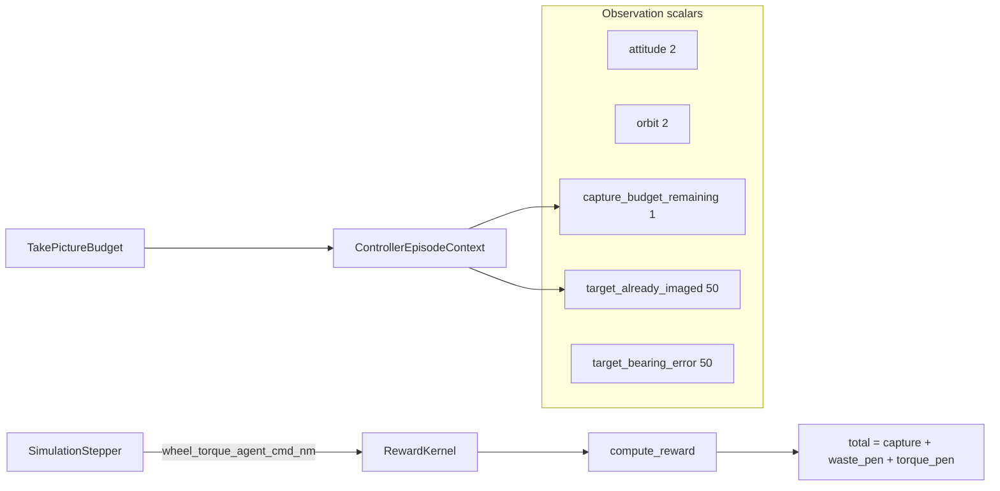

# Markov observation mask + light reward shaping

## Problem (scoped to your choices)

The agent sees bearing errors to all 50 targets but not which targets are already captured. Optimal shutter/torque behavior depends on that hidden state, so the policy averages incompatible cases (random shutter spam). Separately, capture-only reward gives **0** for both "do nothing" and "waste a shutter," and nothing penalizes saturated torque — so MPO gets no dense gradient against those failure modes.

**In scope:** captured-target mask, wasted-shutter penalty, torque² penalty.

**Already present (verified):** `capture_budget_remaining` is wired live in [`episode_runner.py`](backend/autonomous_control/episode_runner.py) `_episode_context()` from `budget.remaining` each step; covered by [`test_controller_mission_scalars.py`](backend/tests/test_controller_mission_scalars.py). No new work unless the mask integration test reveals a regression.

**Deferred (explicit fallback, not optional nice-to-have):** potential-based pointing shaping (`Φ = −min bearing to nearest unseen target`). See [Known risk: passive policy](#known-risk-passive-policy) below.

---

## Known risk: passive policy

This slice adds **penalty-only** dense terms — no positive dense signal for pointing toward unseen targets.

Under the new reward, "do nothing" looks attractive:
- zero torque → no torque penalty
- never press shutter → no waste penalty
- net **0** every step, with no risk

That is strictly better than exploring toward captures while the critic is still bootstrapping. Fixing "max torque + spam shutter" could land on **"never moves, never shoots"** — same root cause (no dense positive signal), opposite symptom.

**Plan assumption:** execute this slice first (mask is structural; penalties are cheap). **Do not treat this as the finish line.**

**If first post-change run shows passive behavior** (near-zero torque variance, zero shutter rate, flat returns): add pointing shaping (`r_shape = γ·Φ(s') − Φ(s)`, `Φ = −min bearing error to nearest *unseen* target`) as the **next** slice before coefficient tuning or algorithm changes.

---

## Architecture



**New S01 dims:** scalars **55 → 105** (+50 mask), vision unchanged **301**, **obs_dim 356 → 406**. Existing `agent.pt` / warmup bundles with `obs_dim=356` will not load — expect cache miss + full warmup rebuild.

---

## 1. Per-target "already imaged" mask (observation)

Follow the existing mission-scalar pattern in [`feature_selection.py`](backend/autonomous_control/feature_selection.py) and [`controller_observation.py`](backend/autonomous_control/controller_observation.py).

| Change | Detail |
|--------|--------|
| `ControllerFeatureConfig` | Add `include_captured_target_mask: bool = False`; extend `needs_mission_scalars` |
| `mission_scalar_key_names()` | After budget keys, append `target_already_imaged_{i}` for `i in range(n_targets)` |
| `ControllerEpisodeContext` | Add `captured_target_indices: frozenset[int] = frozenset()` |
| `mission_scalar_values_from_context()` | Emit `1.0` if `i in captured_target_indices`, else `0.0` |
| [`episode_runner.py`](backend/autonomous_control/episode_runner.py) `_episode_context()` | Pass `frozenset(budget.captured_target_indices)` when `budget is not None`, else empty |
| [`S01_TRAINING_FEATURE_CONFIG`](backend/notebooks/s01/s01_utils/training_workflow.py) | Set `include_captured_target_mask=True` |
| [`notebook_warmup_bundle_cache.py`](backend/autonomous_control/notebook_warmup_bundle_cache.py) `encode_feature_config_snapshot` | Add `include_captured_target_mask` so fingerprint invalidates stale bundles |
| Notebook helpers | Update `_FEATURE_UNITS` (`"1"`), `_episode_context_for_setup()` (default empty set), feature registry table text |

**Encoder:** no structural change — [`ControllerEncoder`](backend/autonomous_control/controller_encoder.py) reads `layout.scalar_dim` automatically.

**Timing:** mask refreshes every obs build; after `apply_shutter_capture()` updates `budget.captured_target_indices`, the next step's obs reflects the capture.

**Test addition:** mask bit flips when `captured_target_indices` changes; budget scalar still tracks `remaining` in the same obs vector.

---

## 2. Wasted-shutter penalty (reward)

**Location:** [`autonomous_control/reward.py`](backend/autonomous_control/reward.py).

**New `RewardConfig` fields:**
- `enable_shutter_waste_penalty: bool = False`
- `k_shutter_waste: float` — **starting guess, not final:** `REWARD_SHUTTER_WASTE_PENALTY = 5.0` (order-of-magnitude of a *partial* capture, not 1:100 vs max capture)
- `shutter_waste_reward_epsilon: float = 1e-3`

**Logic** (after `image_quality_capture_reward` is computed):

```python
if cfg.enable_shutter_waste_penalty and signals.picture_taken:
    applied = components["image_quality_capture_reward"]
    if applied < cfg.shutter_waste_reward_epsilon:
        components["shutter_waste_penalty"] = -cfg.k_shutter_waste
```

Always initialize `"shutter_waste_penalty": 0.0` in `components` (same pattern as other terms — avoids downstream key assertions breaking).

**Semantics:** penalizes accepted shutters with ~zero **applied** credit. Non-shutter steps unaffected. Good captures (~40–100) unaffected.

**Coefficient policy:** ship plumbing + starting constants; **do not** hand-tune to convergence before running. After smoke test, adjust `k_shutter_waste` in one pass if waste-shutter rate unchanged.

---

## 3. Torque² control-effort penalty (reward)

**Why not `enable_energy`:** existing [`energy_reward`](backend/autonomous_control/reward.py) penalizes wheel **momentum change** `(ΔH)²/(2I)`, not commanded torque.

**New `RewardConfig` fields:**
- `enable_torque_effort: bool = False`
- `k_torque_effort: float` — **starting guess:** `REWARD_TORQUE_EFFORT_COEFFICIENT = 0.1` (expect to raise after first run if saturation persists)

**New `RewardSignals` field:** `wheel_torque_cmd_nm: float | None = None`

**Term:**

```python
torque_effort_penalty = -k * (tau_nm / tau_max_nm) ** 2
```

Normalize with [`REACTION_WHEEL_MAX_TORQUE`](backend/environment_definition/constants/SATELLITE.py) (`0.1 N·m`).

**Plumbing:**
- [`reward_kernel.py`](backend/simulation/reward_kernel.py): pass `wheel_torque_cmd_nm` into `RewardSignals`
- [`stepper.py`](backend/simulation/stepper.py): pass `self._wheel_torque_agent_cmd_nm[k]` in `_populate_camera_and_reward` and `_recompute_reward_at`

Applies every control step when enabled.

**Coefficient policy:** `0.1` at full torque → `-0.1/step` → ~`-33` over 330 saturated steps — materially stronger than the original `0.02` proposal, but still tunable. Treat first run as calibration, not validation.

---

## 4. Warmup buffer: obs **and** reward must match

**How rewards enter the buffer today** ([`notebook_warmup_bundle_cache.py`](backend/autonomous_control/notebook_warmup_bundle_cache.py)):
- Cache **miss → rebuild** runs `run_episode()` → stepper → `compute_reward()` → `series.simulation_reward` baked into `EpisodeResult`
- Cache **hit → preload** reads `reward = float(series.simulation_reward[i + 1])` — **not** recomputed from current `RewardConfig`

**Gap:** `warmup_fingerprint_payload()` includes `feature_config` and `obs_dim` but **not** `reward_config`. Changing reward semantics without obs change could silently serve stale cached episodes.

**Fix in this slice:** add `encode_reward_config_snapshot(reward_config)` to warmup fingerprint (mirror feature_config pattern). Include toggles + `k_shutter_waste`, `k_torque_effort`, `shutter_waste_reward_epsilon`.

**Mandatory operator step:** `rebuild_warmup_bundle_cache=True` once (obs_dim change forces this anyway).

**Pre-trust smoke check (2 min, before full train):**
1. Rebuild warmup with new config
2. Spot-check 10 random buffer transitions: non-zero torque steps should have `reward < 0` (torque term); wasted shutter steps should have `reward <= -k_shutter_waste`
3. Confirm `simulation_reward` in a fresh episode series matches `compute_reward` on a sample step (optional one-liner assert in test)

---

## 5. Enable in nb08 training

In [`build_training_workflow_setup()`](backend/notebooks/s01/s01_utils/training_workflow.py):

```python
capture_reward = RewardConfig(
    enable_distance_reward=False,
    enable_image_quality_capture=True,
    enable_shutter_waste_penalty=True,
    enable_torque_effort=True,
)
```

Extend `_reward_config_flags()` / config snapshot JSON.

Pass `reward_config` into warmup fingerprint builder from training workflow setup.

---

## 6. Required success diagnostics (not optional)

Run immediately after the **first** post-change training run, **before** any further iteration:

| Check | What it tells you |
|-------|-------------------|
| **Action histogram** (torque + shutter dims) | Torque effort broke saturation? Policy went passive (all ~0)? |
| **Fraction of shutter cmds with applied reward > ε** | Mask + waste penalty reducing spam? |
| **Mean \|ω\| at shutter time** | High-ω zeroing captures even when novelty OK? |

Log to run telemetry / a short notebook cell / `summary_metrics.json` extension. Cheap to add, expensive to skip given prior unexplained failure.

**Tests vs tuning:** unit tests verify formula wiring only — **passing tests ≠ correct coefficient scale.**

---

## 7. Downstream `components` dict

Adding `shutter_waste_penalty` / `torque_effort_penalty`:
- Always initialize both keys to `0.0` in `compute_reward` (existing pattern)
- Update [`simulation_info.py`](backend/simulation/simulation_info.py) `_reward_program_rows()` so training UI lists new terms when enabled
- Grep for hard-coded `components` key sets in tests — update only if assertions fail (likely `test_area_target_reward.py` sums specific keys; unaffected if new keys default to 0)

---

## 8. Tests (minimal, high-signal)

| File | Add |
|------|-----|
| [`test_controller_mission_scalars.py`](backend/tests/test_controller_mission_scalars.py) | Mask flip; scalar count +50; budget still live |
| [`test_take_picture_reward.py`](backend/tests/test_take_picture_reward.py) | Waste penalty wiring; torque penalty ∝ τ²; good capture unaffected |

Run: `conda activate auto-sat && pytest backend/tests/test_controller_mission_scalars.py backend/tests/test_take_picture_reward.py -q`

---

## 9. Documentation

Update [`docs/presentation/machine-learning.md`](docs/presentation/machine-learning.md):
- Observation: `target_already_imaged_0..49` mask
- Reward: waste + torque penalties (starting coefficients marked as tunable)
- **Fallback section:** pointing shaping if passive policy emerges

---

## Execution sequence (realistic 2-day budget)

1. **Implement** mask + penalties + warmup reward fingerprint (this slice)
2. **Rebuild warmup**, run smoke checks on buffer rewards
3. **Short train run**, run **required diagnostics**
4. **Tune** `k_shutter_waste` / `k_torque_effort` in one pass from histograms
5. **If passive:** add pointing shaping (next slice) — do not burn time on MPO hyperparams first
6. **If still pathological:** prioritized replay / algorithm switch (out of scope here)

---

## File touch list

- [`backend/autonomous_control/feature_selection.py`](backend/autonomous_control/feature_selection.py)
- [`backend/autonomous_control/controller_observation.py`](backend/autonomous_control/controller_observation.py)
- [`backend/autonomous_control/episode_runner.py`](backend/autonomous_control/episode_runner.py)
- [`backend/autonomous_control/reward.py`](backend/autonomous_control/reward.py)
- [`backend/environment_definition/constants/AUTONOMOUS_CONTROL_REWARD.py`](backend/environment_definition/constants/AUTONOMOUS_CONTROL_REWARD.py)
- [`backend/simulation/reward_kernel.py`](backend/simulation/reward_kernel.py)
- [`backend/simulation/stepper.py`](backend/simulation/stepper.py)
- [`backend/simulation/simulation_info.py`](backend/simulation/simulation_info.py)
- [`backend/autonomous_control/notebook_warmup_bundle_cache.py`](backend/autonomous_control/notebook_warmup_bundle_cache.py)
- [`backend/notebooks/s01/s01_utils/training_workflow.py`](backend/notebooks/s01/s01_utils/training_workflow.py)
- [`backend/tests/test_controller_mission_scalars.py`](backend/tests/test_controller_mission_scalars.py)
- [`backend/tests/test_take_picture_reward.py`](backend/tests/test_take_picture_reward.py)
- [`docs/presentation/machine-learning.md`](docs/presentation/machine-learning.md)
