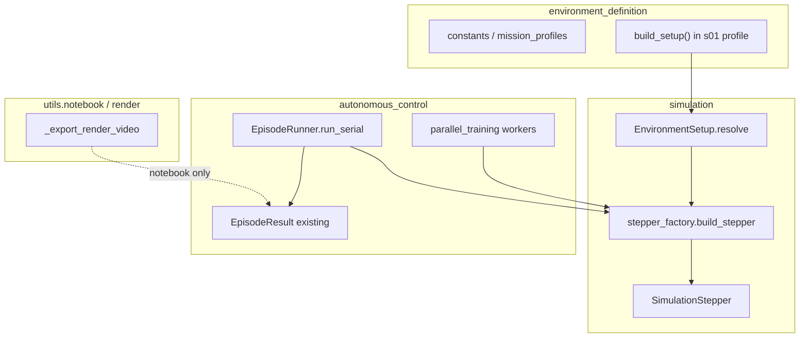

# SimulationRunner v1 (revised)

## Problem today

Notebook and runtime callers manually assemble 10+ kwargs to build [`SimulationStepper`](backend/simulation/stepper.py). Duplicated in:

- [`training_runtime.run_episode`](backend/autonomous_control/training_runtime.py) (lines 221–244)
- [`parallel_training._build_stepper`](backend/autonomous_control/parallel_training.py) (lines 53–76)
- [`scripts/simulation_runner.py`](backend/scripts/simulation_runner.py) (lines 38–58)

Profile mismatch: [`s01_run.ipynb`](backend/notebooks/experiments/s01_run.ipynb) samples altitude from `s01` but `run_episode` hard-imports `SATELLITE` from `s00`.

---

## Design review resolutions

| Risk | Resolution |
|---|---|
| Dual validation ownership | **`EnvironmentSetup.resolve()` is the only owner.** Runner/callers call `setup.resolve()`. No parallel `_ensure_configured()` logic. |
| Public `build_stepper` on runner | **Module-level factory** in `simulation/stepper_factory.py`. Not a public method on a runner class. Workers receive `ResolvedSimulationSetup`, call factory internally. |
| `run_parallel` cross-layer dependency | **Dropped from v1.** `parallel_training` calls the same stepper factory directly. No `simulation/` → `autonomous_control/` wrap. |
| `export_video` on runner | **Dropped.** Notebook/scripts call [`utils.notebook.video._export_render_video`](backend/utils/notebook/video.py) directly (render-is-view-only). |
| Duplicate `s01_*` files / shim | **No `simulation_setups/` dir in v1.** Add `build_setup()` to existing [`mission_profiles/s01_multiple_targets_fwd_fish.py`](backend/environment_definition/mission_profiles/s01_multiple_targets_fwd_fish.py). |
| `EpisodeResult` undefined | **Reuse existing** [`EpisodeResult`](backend/autonomous_control/training_runtime.py) (line 153). Episode orchestration stays in `autonomous_control/`. |
| MP4 smoke test in pytest | **Removed.** No render-to-mp4 in unit tests. Video verified manually in notebook. |

| Merge/delete | Resolution |
|---|---|
| `setup_defaults.py` | **Delete.** Defaults applied inside `resolve()` by referencing `environment_definition.constants` directly. |
| `SatelliteModule` wrapper | **Delete.** Flat `EnvironmentSetup`: `satellite: Satellite`, `cameras: tuple[CameraMount, ...] = ()`. |
| `run_parallel` on runner | **Deferred** (see above). |
| `export_video` on runner | **Deleted** (see above). |
| `simulation_setups/` subdirectory | **Deferred** until a second setup file exists. |

---

## Dependency graph (correct direction)



- **`simulation/`** owns config resolution and stepper construction only.
- **`autonomous_control/`** owns agent loop, `EpisodeResult`, parallel worker orchestration.
- **`render/` / `utils.notebook/`** owns video export (view-only).

---

## Design principles

- **Python setup module** as config file (pint-safe; extend existing mission profile for v1)
- **Cameras optional** on `EnvironmentSetup.cameras` — never auto-inserted; default `()`
- **Payload-agnostic defaults** in `resolve()` only (earth, clouds, orbit margins, targets) — not cameras
- **One episode = one `SimulationStateSeries`** from `SimulationStepper`
- **Imaging rollout with empty cameras** → error only when caller passes `resolve(require_camera=True)` (tested, not default in v1 runner/factory)

---

## 1. Configuration model

### [`backend/simulation/setup_types.py`](backend/simulation/setup_types.py)

```python
@dataclass(frozen=True)
class OrbitConfig:
    altitude: Quantity | None = None
    theta_center: Quantity | None = None
    contact_margin: Quantity | None = None
    motion_span_scale: float | None = None
    sat_z_offset: Quantity | None = None

@dataclass(frozen=True)
class SimulationOverrides:
    camera_pixel_ray_samples: int | None = None
    camera_observation_line_n_bins: int | None = None
    camera_kernel_backend: str | None = None
    reward_config: RewardConfig | None = None  # typed; wired through factory when set

@dataclass(frozen=True)
class EnvironmentSetup:
    satellite: Satellite | None = None
    orbit: OrbitConfig | None = None
    cameras: tuple[CameraMount, ...] = ()          # explicit opt-in only
    clouds: tuple[Cloud, ...] | None = None
    target_areas: tuple[ObservationTargetArea, ...] | None = None
    simulation_overrides: SimulationOverrides | None = None

    def resolve(self, *, require_camera: bool = False) -> ResolvedSimulationSetup: ...
```

`ResolvedSimulationSetup` — frozen, fully populated struct (no `None` for required fields after resolve).

`DEFAULT_NADIR_MOUNT` — convenience constant in `camera_image.py` for setup authors; **not** injected by `resolve()`.

### Setup file (v1: extend existing profile)

Add to [`mission_profiles/s01_multiple_targets_fwd_fish.py`](backend/environment_definition/mission_profiles/s01_multiple_targets_fwd_fish.py):

```python
def build_setup(*, seed: int | None = None, include_cameras: bool = True) -> EnvironmentSetup:
    altitude = sample_satellite_altitude(seed=seed)
    cameras = ()
    if include_cameras:
        scnd = CameraImage.from_fov(...)
        cameras = (DEFAULT_NADIR_MOUNT, CameraMount(scnd, tilt_off_nadir=0 * ureg.deg))
    return EnvironmentSetup(
        satellite=SATELLITE,
        orbit=OrbitConfig(altitude=altitude),
        cameras=cameras,
    )
```

When `include_cameras=False`, bus-only or other-payload experiments leave `cameras=()`.

**Future:** create `environment_definition/simulation_setups/` when a **second** setup module lands (s02, s03…).

---

## 2. Validation — single owner: `resolve()`

All logic in `EnvironmentSetup.resolve()`:

**Required after resolve:**
- `satellite`, `orbit.altitude`

**Auto-fill from `environment_definition.constants` (payload-agnostic):**
- `clouds` ← `SIMULATION.clouds`
- `target_areas` ← `MISSION.OBSERVATION_TARGET_AREAS`
- orbit margin / θ center / span / z-offset ← `SIMULATION.*`
- earth constants passed through to factory from same sources

**Never auto-filled:** `cameras` (stays `()` unless setup author sets it)

**When `require_camera=True` (imaging rollouts) and `cameras` empty:**
> `SimulationSetupError: cameras is empty but require_camera=True. Add CameraMount(...) in build_setup().`

Tests call `setup.resolve()` directly — no duplicate validation path.

---

## 3. Stepper factory (internal shared API)

### [`backend/simulation/stepper_factory.py`](backend/simulation/stepper_factory.py)

```python
def build_stepper(
    resolved: ResolvedSimulationSetup,
    *,
    simulation_config: SimulationConfig,
    require_camera: bool = False,  # v1 default; True when SensorKernel wiring lands
) -> SimulationStepper:
    ...
```

- Sole constructor of `SimulationStepper` from resolved setup
- Computes `los_theta_offsets_deg(orbit_height=resolved.orbit.altitude, ...)`
- Passes `reward_config` from `resolved.simulation_overrides` when set
- **v1 camera wiring:** stepper/sensor still use existing `SATELLITE.py` / module constants — `resolved.cameras` is stored but not passed into `SensorKernel` yet. `require_camera` on factory is **`False` by default in v1**; set `True` only in the follow-up slice that wires cameras into the stepper.

**Callers (not public runner class):**
- [`EpisodeRunner.run_serial`](backend/autonomous_control/episode_runner.py)
- [`parallel_training._build_stepper`](backend/autonomous_control/parallel_training.py) — replaces duplicated block, **does not** go through a runner wrapper

---

## 4. Episode orchestration (autonomous_control layer)

### [`backend/autonomous_control/episode_runner.py`](backend/autonomous_control/episode_runner.py)

```python
class EpisodeRunner:
    def __init__(self, setup: EnvironmentSetup): ...
    def run_serial(self, agent, *, mode: str, ...) -> EpisodeResult: ...
```

- Calls `self._resolved = setup.resolve(require_camera=False)` once at init — **v1 does not enforce cameras** because they are not wired into the stepper yet. `require_camera=True` on `resolve()` is implemented and tested but reserved for the SensorKernel wiring slice; callers may pass it explicitly once that slice lands.
- Uses `build_stepper(self._resolved, require_camera=False, ...)` — never exposes factory publicly on self
- Extracts agent loop from current `run_episode` (tqdm on steps stays here)
- Returns existing **`EpisodeResult`** (states, simulation_series, steps, episode_return, controller interval fields)

### [`training_runtime.run_episode`](backend/autonomous_control/training_runtime.py)

Thin backward-compat wrapper:

```python
def run_episode(..., setup: EnvironmentSetup | None = None) -> EpisodeResult:
    effective_setup = setup or build_setup(seed=0)  # explicit nadir camera in build_setup
    return EpisodeRunner(effective_setup).run_serial(agent, mode=mode, ...)
```

(`effective_setup` is an unresolved `EnvironmentSetup`; `EpisodeRunner` calls `.resolve()` internally.)

---

## 5. Caller migration

| Caller | Change |
|---|---|
| `training_runtime.run_episode` | Delegate to `EpisodeRunner`; optional `setup` arg |
| `parallel_training._build_stepper` | `build_stepper(setup.resolve(require_camera=False), ...)` — same factory |
| `simulation_runner.py` | **Does not use `EpisodeRunner`** (no RL agent). See **§5.1 `run_baseline_rollout` split** below. Script becomes: `run_simulation(setup=build_setup(seed=0), simulation_config=...)`. |
| `s01_run.ipynb` | `build_setup(seed=SEED)` + `EpisodeRunner(...).run_serial(...)` + `_export_render_video` directly |

**Not in v1:** `run_parallel` on any runner class; `export_video` on runner; `simulation_setups/` directory.

### 5.1 `run_baseline_rollout` split (scope watch)

Today [`run_simulation()`](backend/simulation/run_simulation.py) is a thin pass-through to [`run_baseline_rollout()`](backend/simulation/stepper.py) (lines 422–482), and **`run_baseline_rollout` builds its own `SimulationStepper`** (lines 442–457) before running the baseline/random controller loop (lines 459–482).

Wiring `build_stepper` into `run_simulation` therefore **requires a refactor in `stepper.py`** — not only `run_simulation.py`. Planned split:

```python
# stepper.py — extract loop only
def run_baseline_rollout_from_stepper(
    stepper: SimulationStepper,
    *,
    simulation_config: SimulationConfig,
    show_progress: bool = True,
) -> SimulationStateSeries:
    ...  # controller build + while not stepper.done loop (today lines 459–482)

# stepper.py — legacy flat-kwargs entry becomes thin during migration
def run_baseline_rollout(...) -> SimulationStateSeries:
    stepper = SimulationStepper(...)  # replaced by build_stepper(resolved, ...) at call sites
    return run_baseline_rollout_from_stepper(stepper, simulation_config=..., ...)
```

**`run_simulation` migration path (explicit, no fork):**

1. Accept optional `setup: EnvironmentSetup | None` (+ keep legacy flat kwargs temporarily if needed for tests).
2. `resolved = setup.resolve(require_camera=False)` when setup provided.
3. `stepper = build_stepper(resolved, simulation_config=sim_config)`.
4. `return run_baseline_rollout_from_stepper(stepper, simulation_config=sim_config, ...)`.

Do **not** duplicate the rollout loop in `run_simulation.py`. Construction moves to factory; loop stays in `stepper.py`.

---

## 6. Notebook target

```python
from environment_definition.mission_profiles.s01_multiple_targets_fwd_fish import build_setup
from autonomous_control.episode_runner import EpisodeRunner
from utils.notebook.video import _export_render_video

setup = build_setup(seed=SEED)
result = EpisodeRunner(setup).run_serial(warmup_agent, mode="warmup", warmup_controller="random")

video_path = RUN_DIR / "warmup_01.mp4"
_export_render_video(simulation_series=result.simulation_series, out_path=video_path)
saved_videos.append(video_path)
```

Cell 4 (play from disk) unchanged.

---

## 7. Tests (TDD)

1. **`test_simulation_setup.py`**
   - `resolve()` fills non-payload defaults
   - missing altitude → `SimulationSetupError`
   - empty `cameras=()` allowed
   - `resolve(require_camera=True)` with empty cameras → error
   - multi-camera setup stores all mounts

2. **`test_episode_runner.py`** (not `test_simulation_runner.py`)
   - factory + default setup → same stepper horizon as today's direct construction
   - `run_serial` → `EpisodeResult` with `SimulationStateSeries` (reuse existing artifact tests pattern)
   - **No MP4 / render tests**

3. Keep **`test_training_runtime_episode_artifact.py`** green via `run_episode()` default `build_setup()`

---

## 8. Scope: 3 more configurations

**What scales without code changes:**
- Each new scenario = new `build_setup()` in its mission profile module (or later `simulation_setups/s0N_*.py`)
- `EnvironmentSetup` + `resolve()` + factory unchanged
- Per-config variation via `simulation_overrides` (timestep, kernel backend, ray samples, **`reward_config`**)

**Risks when adding 3+ configs:**

| Risk | Mitigation |
|---|---|
| Non-nadir / tilted / secondary camera drives rewards | Forces **SensorKernel camera wiring** slice earlier than planned — track as blocker when any s0N setup needs it |
| Different `RewardConfig` per setup | Type and wire `simulation_overrides.reward_config` through factory in v1 (small addition) |
| Profile file clutter | Create `simulation_setups/` **when second setup lands**, not before |
| `mission_profiles/` mixing globals + `build_setup` | New setups prefer `build_setup()` only; gradually stop adding module-level mutable globals |

**Verdict:** Core model is right-sized for multi-config. Main early pressure is **camera wiring into stepper** and **per-setup reward_config**.

---

## 9. Out of scope (follow-up)

- `run_parallel` wrapper / runner orchestration of worker pool
- Wiring secondary (or arbitrary) cameras into [`SensorKernel`](backend/simulation/sensor_kernel.py)
- YAML/TOML config loader
- Per-camera fields on `SimulationStateSeries`
- `docs/presentation/technical-constants.md`
- `simulation_setups/` directory (until 2+ setup files)

---

## 10. File map

**New**
- `simulation/setup_types.py`
- `simulation/stepper_factory.py`
- `autonomous_control/episode_runner.py`
- `tests/test_simulation_setup.py`
- `tests/test_episode_runner.py`

**Touched**
- `environment_definition/mission_profiles/s01_multiple_targets_fwd_fish.py` — add `build_setup()`
- `simulation/stepper.py` — extract `run_baseline_rollout_from_stepper`; retire inline `SimulationStepper(...)` construction from `run_baseline_rollout` at migrated call sites
- `simulation/run_simulation.py` — accept `EnvironmentSetup`, factory + `run_baseline_rollout_from_stepper`
- `autonomous_control/training_runtime.py`
- `autonomous_control/parallel_training.py`
- `scripts/simulation_runner.py` — pass setup into refactored `run_simulation()`
- `notebooks/experiments/s01_run.ipynb`

**Not created**
- `setup_defaults.py`
- `SatelliteModule`
- `simulation/runner.py` (split into factory + episode_runner)
- `environment_definition/simulation_setups/` (v1)

---

## Verification

```bash
conda activate ASC
pytest backend/tests/test_simulation_setup.py backend/tests/test_episode_runner.py backend/tests/test_training_runtime_episode_artifact.py -v
```

Manual: `s01_run.ipynb` cells 0 → 3 → 4 (save + play video from disk).
