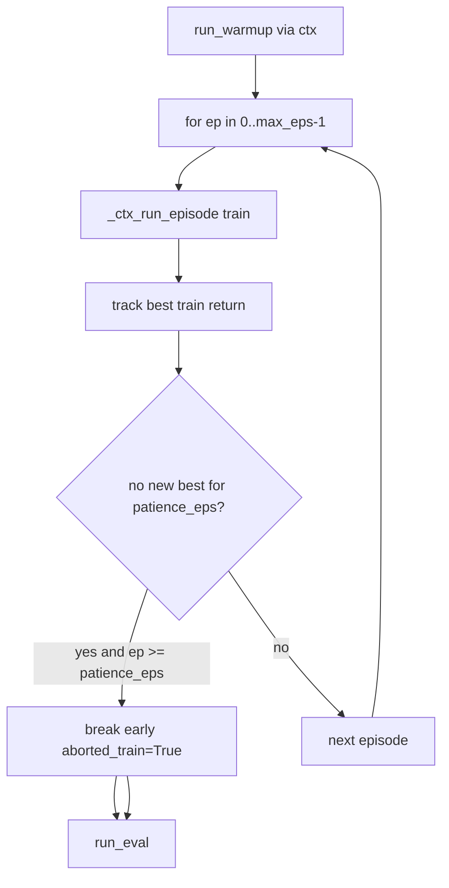
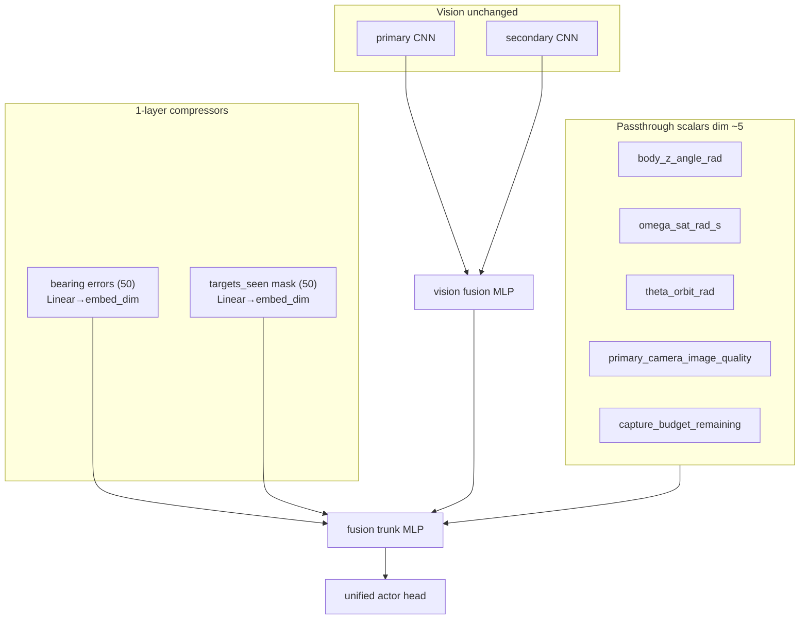
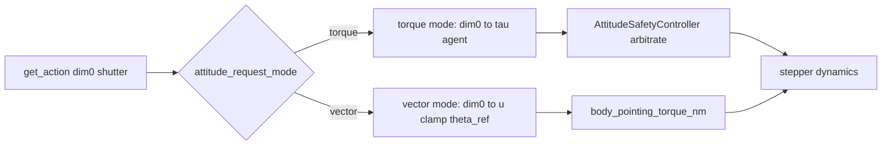

# ML experiment master plan (dt 1.5s)

## Run order (mandatory sequence)

| # | Experiment | Folder | Primary agent | Notes |
|---|------------|--------|---------------|-------|
| **1** | Shutter threshold | [`ml_shutter_threshold/`](backend/scripts/experiments/ml_shutter_threshold/) | **MPO** sparse | 0.5 vs 0.9; 15s capture window; plots |
| **2** | Modular encoder | [`ml_modular_encoder/`](backend/scripts/experiments/ml_modular_encoder/) | **SAC** sparse | A0 flat vs A1 vector-compress; SAC only overnight learner |
| **3** | SAC vs MPO compare | [`ml_algo_overnight/`](backend/scripts/experiments/ml_algo_overnight/) | SAC + MPO | sparse vs dense; up to 20 eps + patience |
| **4** | Agent-reference pointing | [`ml_agent_reference_pointing/`](backend/scripts/experiments/ml_agent_reference_pointing/) | SAC (+ opt. MPO) | dim0 = orientation ref, not torque; simple OBC PD fork |

**Shared defaults:** `sim_dt_s=1.5`, `controller_interval_s=1.5`, **`rebuild_warmup_bundle_cache=True`** on every arm (warmup is fast; avoids stale cross-experiment bundles).

**Retired:** MPC pointing experiment ([`mpc_pointing_experiment` plan](.cursor/plans/mpc_pointing_experiment_05c562c2.plan.md)) — replaced by **#4 agent-reference** (PD OBC, not QP/MPC).

---

## Execution playbook (how not to break prod)

The plan body below is the **spec**. During execution, treat each experiment folder as an **isolated island** — same pattern as [`ml_algo_overnight/SUBAGENT_CHARTER.md`](backend/scripts/experiments/ml_algo_overnight/SUBAGENT_CHARTER.md).

### Golden rules

1. **Production read-only** until a explicit *promote* step after a `supported` verdict: no edits to `backend/autonomous_control/**`, `backend/simulation/**`, `backend/render/**`, or `training_workflow.py` during hypothesis runs.
2. **One closeout per agent session** — e.g. “implement + run **Exp 1** only”, not “implement all four”. Scope creep is how prod gets touched.
3. **Mandatory order 1 → 2 → 3 → 4** — do not start N+1 until N has JSON + analysis card + verdict recorded in the run log.
4. **Fork, don’t patch** — new behavior lives under `backend/scripts/experiments/<slug>/**` (`_*_fork.py`, vendored copies, monkeypatch at runtime). Copy `_runner_common`, `_run_guard`, `_warmup_fingerprint_patch` from overnight; don’t reinvent.
5. **One training job per machine** — reuse `.experiment_run.lock` via `_run_guard.py` in each slug folder.
6. **Smoke before train** — every new entry script gets a `--smoke` or 1-ep dry run before a full matrix.

### Per-experiment checklist (copy into each slug’s README)

| Step | Done when |
|------|-----------|
| `SUBAGENT_CHARTER.md` | Protected vs editable paths listed |
| `<hypothesis>.md` | One-sentence hypothesis + KPI |
| Scaffold + smoke | Entry script runs without import errors |
| Arms run | `results/*.json` written via `write_hypothesis_result` |
| Analysis card | `results/*_analysis.md` or slug-level `*_analysis.md` |
| Verdict | `supported` / `inconclusive` / `falsified` in JSON |
| Run log line | Row added to master log (below) |
| **Stop** | Do not promote to prod yet |

### Master run log (single source of “where are we?”)

Maintain **[`docs/ml/experiments/RUNLOG_2026-06.md`](docs/ml/experiments/RUNLOG_2026-06.md)** — one table row per experiment / arm:

```text
| # | slug | arm | status | verdict | json | analysis | notes |
```

Update **only** at closeout (not mid-implementation). The plan todos mirror this; the run log is the human checklist.

### What to verify so prod stays safe

- `git diff` before any commit: changed paths ⊆ current experiment folder (+ docs/run log).
- No new imports *from* experiment folders *into* production modules (one-way: experiment → prod imports OK).
- After each run: `git status` — reject accidental `__pycache__` / `results/` commits unless intentional artifacts policy says otherwise.
- If a fix is **required** in prod to unblock an experiment: **stop**, document in run log, fix in a **separate** minimal commit/PR before resuming the hypothesis folder.

### Session prompts (paste to agent)

Use explicit boundaries:

- *“Implement Exp 1 (`ml_shutter_threshold`) only. Charter-compliant. Smoke then `mpo_t05`/`mpo_t09`. Update RUNLOG when done.”*
- *“Exp 3 compare phase only: `dense` rename + early abort + `compare_sac_mpo.py`. Do not touch Exp 4.”*

### When something fails

1. Read `results/*_error.json` / overnight.log pattern — don’t guess.
2. Fix **inside the experiment folder** first (99% of overnight bugs were there).
3. Re-run **only the failed arm**, not the full matrix.
4. Record failure + fix in analysis card § debug.

### Promotion (later, separate plan)

Only after verdict `supported`: minimal vertical slice into prod, run `pytest` on touched areas, re-run one control arm. **Exp 4 OBC modes** and **dense reward rename** are independent promote candidates — never one big merge.

---

## Core agent boundary (all experiments)

Environment + simulation are **fixed**; agents are **pluggable** at `get_action(obs, train)`.

- **Sim side:** [`run_simulation`](backend/simulation/run_simulation.py) → [`EpisodeRunner`](backend/autonomous_control/episode_runner.py) → `ControllerObservation` from [`controller_observation.py`](backend/autonomous_control/controller_observation.py).
- **Agent side:** `get_action` returns shape `(2,)` — `[dim0, shutter_gym]`. **dim0 semantics:** torque fraction (default) **or** orientation command `u∈[-1,1]` (experiment #4). Implementations: MPO, SAC fork, compressed encoder SAC, reference-command episode fork.
- **Swap pattern:** `dataclasses.replace(setup, agent=...)` after `build_training_workflow_setup()` — experiment #4 additionally forks the episode loop / OBC reference path (production read-only during hypothesis phase).

---

## What already exists (reuse)

| Piece | Location | Status |
|-------|----------|--------|
| SAC agent | [`agents/sac_agent_fork.py`](backend/scripts/experiments/ml_algo_overnight/agents/sac_agent_fork.py) | Ready (incl. checkpoint stubs from last run) |
| MPO via notebook workflow | [`_runner_common.run_hypothesis_phase`](backend/scripts/experiments/ml_algo_overnight/_runner_common.py) | Ready |
| Reward fork hook | [`_reward_fork.py`](backend/scripts/experiments/ml_algo_overnight/_reward_fork.py) | Has `sparse` + `dense_latent_10x_applied` (H6) — **rename to `dense`**, same formula |
| dt monkeypatch | [`_sim_constants_fork.py`](backend/scripts/experiments/ml_algo_overnight/_sim_constants_fork.py) | Ready; needs new fixed profile |
| Phase runner + JSON | `PhaseSpec`, `evaluate_learning_mode`, videos | Ready |
| H4 sparse SAC | [`_phases/h4_sac.py`](backend/scripts/experiments/ml_algo_overnight/_phases/h4_sac.py) | `reward_mode="sparse"` |

## Reward design (sparse vs dense)

Two fork modes only — **`sparse`** and **`dense`**. Do **not** add a lighter “latent-only” variant; overnight H6 already tested dense credit and did not justify weakening the amplifier.

- **SAC — `sparse`:** same as overnight H4 / production training contract ([`training_workflow.py`](backend/notebooks/s01/s01_utils/training_workflow.py) L753–758). `total` credits applied capture at shutter steps only; the per-step **imaging-quality signal** (`latent_capture_reward` in components) is computed for logging/UI but **not** added to `total`. Fork mode = `sparse` (no patch, or explicit no-op).

- **MPO — `dense`:** reuse the **existing H6 fork** in [`_reward_fork.py`](backend/scripts/experiments/ml_algo_overnight/_reward_fork.py) — rename mode string from `dense_latent_10x_applied` → **`dense`** (keep old name as alias so H6 JSON/phases still parse):

```python
# _reward_fork.py — dense branch (unchanged logic from H6)
latent = float(components.get("latent_capture_reward", 0.0))
applied = float(components.get("image_quality_capture_reward", 0.0))
total = float(total) - applied + applied * 10.0 + latent
```

**Semantics:** every step adds **imaging reward** into `total` (so it is no longer “latent” in the training signal — hence the name **`dense`**, not `dense_latent`). At shutter steps, **applied capture** is amplified **10×** (same as H6). This matches your intent: stronger credit when the shutter fires, plus dense per-step imaging credit — not `total += latent` without the 10× shutter boost.

**No new reward math** for compare run — only rename + wire MPO arm to `reward_mode="dense"`.

## Fixed timestep profile

Target: **`sim_dt_s=1.5`**, **`controller_interval_s=1.5`**, **`effective_controller_interval_s=1.5`** (1 control decision per sim step — same as overnight H0 winner).

Reuse existing candidate in [`_sim_constants_fork.py`](backend/scripts/experiments/ml_algo_overnight/_sim_constants_fork.py):

```python
FIXED_COMPARE_PROFILE = DtProfile(1.5, 1.5, 1.5, "dt_1.5s")  # alias of DT_CANDIDATES dt_1.5s
```

Add helper `write_fixed_compare_dt_profile(*, train_episodes=20)` that writes [`results/dt_profile.json`](backend/scripts/experiments/ml_algo_overnight/results/dt_profile.json) without running H0 sweep:

```json
{
  "aborted": false,
  "sim_dt_s": 1.5,
  "controller_interval_s": 1.5,
  "effective_controller_interval_s": 1.5,
  "label": "dt_1.5s",
  "train_episodes": 20,
  "source": "fixed_compare"
}
```

`apply_runtime_context_from_dt_profile()` in [`_runner_common.py`](backend/scripts/experiments/ml_algo_overnight/_runner_common.py) already reads this file — no notebook changes.

**Rationale:** Aligns compare run with overnight H6/H4 timing (apples-to-apples with prior MPO/SAC results at dt 1.5s); shares profile with shutter-threshold and modular-encoder experiments.

**Warmup cache (all experiments):** default **`rebuild_warmup_bundle_cache=True`** on every `PhaseSpec` / runner call. Fingerprint still includes `reward_mode`, `sim_dt_s`, `controller_interval_s` via [`_warmup_fingerprint_patch.py`](backend/scripts/experiments/ml_algo_overnight/_warmup_fingerprint_patch.py) — rebuild guarantees each arm gets a bundle matching its active fork.

---

## Track 3 — SAC vs MPO compare (exp #3)

### Early abort (new — not in repo today)

No reward-plateau stop exists. [`run_training`](backend/notebooks/s01/s01_utils/training_workflow.py) runs a fixed `for ep in range(train_episodes)` loop; only `early_stop_on_budget_exhausted` exists (capture budget, not learning).

Implement **in experiment folder only** as `_training_loop_fork.py`:



**Patience rule (default):** stop if **no strict improvement in best train episode return for 10 consecutive completed train episodes** (after at least 10 train eps). Max cap: **20** (from `dt_profile.train_episodes`).

Record in KPIs: `train_episodes_completed`, `early_aborted`, `early_abort_reason`, `best_train_return`, `best_train_episode_idx`.

Wire via new `run_hypothesis_phase_with_early_abort(...)` in [`_runner_common.py`](backend/scripts/experiments/ml_algo_overnight/_runner_common.py) that mirrors `run_hypothesis_phase` but calls the forked train loop instead of `tw.run_training_workflow()`.

Extend `PhaseSpec`:

```python
train_episodes: int | None = None      # override dt_profile
max_train_episodes: int = 20
patience_episodes: int = 10
```

## New compare phase

Add [`_phases/compare_sac_mpo.py`](backend/scripts/experiments/ml_algo_overnight/_phases/compare_sac_mpo.py):

1. `write_fixed_compare_dt_profile(train_episodes=20)`
2. **SAC arm** — `PhaseSpec(phase_id="compare_sac", agent_kind="sac", reward_mode="sparse", rebuild_warmup_cache=True)`
3. **MPO arm** — `PhaseSpec(phase_id="compare_mpo", agent_kind="mpo", reward_mode="dense", rebuild_warmup_cache=True)`
4. Write [`results/compare_sac_mpo.json`](backend/scripts/experiments/ml_algo_overnight/results/compare_sac_mpo.json) + short `compare_sac_mpo_analysis.md` with side-by-side: train curves, eval mean, `learning_mode`, KL (MPO), `positive_reward_steps`, early-abort flags, wall time.

Register in [`run_overnight.py`](backend/scripts/experiments/ml_algo_overnight/run_overnight.py):

- New CLI: `--compare-sac-mpo` **or** `--phases compare_sac_mpo`
- Skip smoke/H0 when compare flag set (still run smoke optional via existing `--smoke-only`)
- Compare phase does **not** auto-skip on existing `h1a`/`h4` JSON paths

## Run command (after implementation)

```powershell
$env:KMP_DUPLICATE_LIB_OK='TRUE'
conda activate auto-sat
cd D:\code\sem-proj-asc\backend\scripts\experiments\ml_algo_overnight
python .\run_overnight.py --compare-sac-mpo --show-progress
```

Expected wall time: up to ~2× (SAC + MPO) × up to 20 train eps × ~8–12 min/ep at dt 1.5s — early abort may cut this roughly in half if plateau hits.

## Files to touch (experiment folder only)

| File | Change |
|------|--------|
| [`_reward_fork.py`](backend/scripts/experiments/ml_algo_overnight/_reward_fork.py) | Rename `dense_latent_10x_applied` → `dense`; backward-compat alias only |
| [`_sim_constants_fork.py`](backend/scripts/experiments/ml_algo_overnight/_sim_constants_fork.py) | `FIXED_COMPARE_PROFILE` + `write_fixed_compare_dt_profile()` |
| [`_training_loop_fork.py`](backend/scripts/experiments/ml_algo_overnight/_training_loop_fork.py) | **New** — patience early abort train loop |
| [`_runner_common.py`](backend/scripts/experiments/ml_algo_overnight/_runner_common.py) | Extend `PhaseSpec`; `run_hypothesis_phase_with_early_abort`; update `RewardForkMode` import |
| [`_phases/compare_sac_mpo.py`](backend/scripts/experiments/ml_algo_overnight/_phases/compare_sac_mpo.py) | **New** — orchestrate both arms |
| [`run_overnight.py`](backend/scripts/experiments/ml_algo_overnight/run_overnight.py) | CLI flag + dispatch |
| [`docs/ml/experiments/ml_algo_overnight_2026-06.md`](docs/ml/experiments/ml_algo_overnight_2026-06.md) | **New** — first-run findings for report |
| [`docs/report/semester-project/report-direction-log.md`](docs/report/semester-project/report-direction-log.md) | One-line cross-link to findings doc |

No changes to `backend/autonomous_control/**`, `backend/simulation/**`, or `training_workflow.py` (charter-compliant).

## Success criteria for the run

| Signal | SAC (sparse) | MPO (dense) |
|--------|----------------|-------------|
| `learning_mode` | baseline from overnight | does dense imaging + 10× shutter credit unblock MPO? |
| Best train return vs ep 0 | improving? | improving vs −243 floor? |
| `positive_reward_steps` | >0 sustained? | >0 when on-target? |
| Early abort | if plateau at ep ≤10 | same patience rule |
| MPO `kl_mean_last` | n/a | < 1e4 would be necessary for `learning_mode` |

## Optional follow-up (out of scope)

- Symmetric compare (both dense) — only if SAC sparse shows nothing
- Promote winning arm to longer 50-ep run without patience
- Lighter dense variant (`total += latent` only, no 10×) — **out of scope** unless a future hypothesis explicitly needs it
- Update [`docs/presentation/machine-learning.md`](docs/presentation/machine-learning.md) if `dense` fork becomes production policy

---

## Report source document (first overnight run)

Write a durable findings record for semester-report reuse — **separate from** per-run JSON/analysis cards under `results/`.

**Path:** [`docs/ml/experiments/ml_algo_overnight_2026-06.md`](docs/ml/experiments/ml_algo_overnight_2026-06.md) (new file + `experiments/` subfolder under existing [`docs/ml/`](docs/ml/) alongside [`MPO_v1.md`](docs/ml/MPO_v1.md), [`reward_v1_implementation.md`](docs/ml/reward_v1_implementation.md)).

**Cross-link:** Add a short entry to [`docs/report/semester-project/report-direction-log.md`](docs/report/semester-project/report-direction-log.md) under a new “Session — ml_algo_overnight (2026-06)” heading pointing to this file (living record pattern, not LaTeX body text).

**Suggested structure** (slideshow-style `---` separators optional, matching `docs/presentation/` convention):

1. **Purpose & contract** — frozen S01 knobs (seed 7, 5 warmup, 7 train @ dt=1.5s from H0), primary KPI `learning_mode`, link to [`backend/scripts/experiments/ml_algo_overnight/README.md`](backend/scripts/experiments/ml_algo_overnight/README.md)
2. **H0 outcome** — chose `dt_1.5s`, 7 train episodes; note coarser-than-production caveat
3. **Phase results table** — H1a / H1b / H6 / H4: verdict, train returns, eval mean, `learning_mode`
4. **Reward signal analysis** — **sparse:** imaging component in breakdown only, not in `total`; **dense:** imaging in `total` every step + 10× applied capture at shutter (H6); penalty floor ~−243; shutter spam (~968 vs baseline 50)
5. **Algorithm findings** — MPO failed (KL blow-up, η runaway in H1a); frozen η (H1b) did not help; dense (H6) did not help off-target at dt 1.5s; **SAC only `learning_mode=true`** (weak: eval −168, early peak then regression)
6. **Infrastructure notes** — bugs fixed during run (H0 preload, JSON serialization, SAC checkpoint stubs, H1b frozen-η backward) — brief, for reproducibility
7. **Decision tree outcome** — README matrix row: “H4 yes, MPO not → algorithm swap”; deferred phases pointer
8. **Artifacts index** — paths to `overnight_summary.json`, analysis cards, video run_dirs
9. **Next experiments** — ordered sequence: (1) shutter MPO, (2) modular encoder SAC, (3) SAC vs MPO compare, (4) agent-reference pointing — update after each completes

**When to write:** Create/update **before or in parallel with** compare-phase implementation so the first-run narrative is captured while fresh; append a “Compare run (2026-06)” section after `--compare-sac-mpo` finishes.

**Not in scope:** Duplicating numeric tables already in JSON; no changes to `docs/presentation/*.md` unless reward fork semantics become production policy (per math-physics rule).

---

## Track 1 — Shutter threshold (exp #1, MPO only)

**Goal:** Test whether raising the shutter **decision threshold** from **0.5 → 0.9** reduces MPO shutter spam (~968 cmds/ep overnight) and improves learning. Deliver **matplotlib plots** of shutter signal distribution and per-episode fire counts.

**Agent:** **MPO only**, `sparse` reward (shutter pathology is MPO-specific in overnight run). SAC omitted to save wall time; compare run (#3) covers SAC.

**Defaults:** `rebuild_warmup_bundle_cache=True` per arm; dt 1.5s / ci 1.5s; 7 train episodes.

### Mechanism (terminology)

Production path is **not** a sigmoid on the shutter dim:

1. Actor outputs **tanh-squashed** actions in `[-1, 1]` ([`controller_agent.py`](backend/autonomous_control/controller_agent.py)).
2. Shutter dim maps linearly to unit interval: `shutter_unit = 0.5 * (clip(gym, -1, 1) + 1)` ([`action_adapter.shutter_gym_to_unit_interval`](backend/autonomous_control/action_adapter.py)).
3. Shutter fires when `shutter_unit > threshold` (default **0.5**; at **0.9** requires `shutter_gym > 0.8`).

Prior art: [`ml_learning_signal/b_bug_hunt/run_b1.py`](backend/scripts/experiments/ml_learning_signal/b_bug_hunt/run_b1.py) tested **0.35** (lower); this experiment tests **0.9** (stricter). Document both in findings.

### Sim profile (per your direction — not compare-run dt)

| Knob | Value | Notes |
|------|-------|-------|
| `sim_dt_s` | **1.5** | Same as compare run and overnight H0 |
| `controller_interval_s` | **1.5** | 1 control decision per sim step |
| `train_episodes` | **7** | Match overnight H0 budget |
| `capture_credit_window_s` | **15** | **New experiment fork** — see below |

Reuse [`DtProfile(1.5, 1.5, 1.5, "dt_1.5s")`](backend/scripts/experiments/ml_algo_overnight/_sim_constants_fork.py) via copied/adapted `_sim_constants_fork.py` in the new experiment folder (do **not** re-run H0 sweep).

### 15 s capture-credit window (new fork)

Production reward credits **applied capture once** at shutter cmd step; **latent** is computed every step but not in sparse `total`. Your intent: while “locked on target” for **15 s**, accumulate reward each step → at dt=1.5s that is **10 steps** (~10× denser credit per capture event).

**Experiment-only** implementation in new folder (`_capture_window_fork.py`):

- On accepted shutter cmd (`apply_shutter_capture` or equivalent hook), start a module-level window counter `remaining_steps = round(15 / sim_dt_s)`.
- Each subsequent sim step while `remaining_steps > 0`: patch `compute_reward` (same pattern as [`_reward_fork.py`](backend/scripts/experiments/ml_algo_overnight/_reward_fork.py)) to add `latent_capture_reward` into `total` (dense credit during window only).
- Reset counter when window expires; do **not** modify `backend/simulation/**` or `backend/autonomous_control/reward.py` directly.

**Charter:** experiment folder only; monkeypatch `episode_runner` / `reward.compute_reward` like existing learning-signal forks.

**Report note:** Record as **interim dense-credit probe** (windowed imaging in `total`), distinct from production **sparse** and from compare-run **dense** (full H6 formula).

### Experiment layout

**New folder:** [`backend/scripts/experiments/ml_shutter_threshold/`](backend/scripts/experiments/ml_shutter_threshold/)

| File | Role |
|------|------|
| `README.md` | Hypothesis, matrix, run command |
| `SUBAGENT_CHARTER.md` | Editable paths = this folder only |
| `_shutter_threshold_fork.py` | Context manager: patch `DEFAULT_SHUTTER_THRESHOLD` + `episode_runner.policy_output_to_gym_action` (pattern from `run_b1.py`) |
| `_capture_window_fork.py` | 15 s dense latent credit window |
| `_sim_constants_fork.py` | Apply dt 1.5s profile |
| `_collect_shutter_samples.py` | At each **controller** step: record `shutter_gym`, `shutter_unit`, `fired` |
| `_plot_shutter.py` | Matplotlib → `results/plots/*.png` |
| `_runner_common.py` | Run 7-ep train slice per arm; JSON KPIs |
| `run_shutter_threshold.py` | Entry point |

**Arm matrix (2 training runs + shared diagnostics):**

| Agent | Reward | Threshold 0.5 | Threshold 0.9 |
|-------|--------|---------------|---------------|
| MPO | sparse | `mpo_t05` | `mpo_t09` |

- MPO: production agent via notebook workflow (import-only `s01_utils`).
- All arms: `capture_credit_window_s=15` fork **on**; sparse base reward otherwise.
- `rebuild_warmup_bundle_cache=True` on each arm.

### Plots (required deliverables)

Save under `results/plots/`:

1. **`shutter_unit_hist.png`** — histogram / KDE of `shutter_unit` at controller steps; vertical lines at 0.5 and 0.9; compare `mpo_t05` vs `mpo_t09`.
2. **`fire_rate_vs_threshold.png`** — counterfactual: same action samples, fire rate vs threshold sweep (0.35–0.95).
3. **`shutter_cmds_per_episode.png`** — bars: cmds/ep for `mpo_t05` vs `mpo_t09` across train eps 0–6.
4. **`train_returns.png`** — line plot per arm (optional but useful for report).
5. **`shutter_unit_by_episode.png`** — ridgeline or small multiples showing distribution drift across training (detect policy pushing gym dim up to beat 0.9).

Also write `results/shutter_threshold_summary.json` + `shutter_threshold_analysis.md`.

### Run command

```powershell
$env:KMP_DUPLICATE_LIB_OK='TRUE'
conda activate auto-sat
cd D:\code\sem-proj-asc\backend\scripts\experiments\ml_shutter_threshold
python .\run_shutter_threshold.py --show-progress
```

Optional: `--thresholds 0.5,0.9` (default), `--skip-train` (plots from policy samples only).

### Success criteria

| Question | Evidence |
|----------|----------|
| Does 0.9 cut shutter spam? | `shutter_cmds_per_episode` drops vs 0.5 |
| Does 0.9 help returns? | Train/eval return vs 0.5; `positive_reward_steps` |
| Does 15 s window add signal? | More positive steps vs overnight MPO sparse baseline |

### Docs

Sibling [`docs/ml/experiments/ml_shutter_threshold_2026-06.md`](docs/ml/experiments/ml_shutter_threshold_2026-06.md) after run.

---

## Track 2 — Modular encoder (exp #2, SAC only)

**Rationale for SAC (not MPO):** Overnight **only SAC** hit `learning_mode=true`; encoder probe should use the algorithm that already learns, isolating observation architecture from MPO KL/η failure modes.

**Defaults:** `rebuild_warmup_bundle_cache=True` per arm (A0, A1); dt 1.5s; 7 train eps; sparse reward.

**Goal:** Test a **lightweight** input layout: compress per-target **vectors** into small embeddings; pass **single scalars** through unchanged; keep vision CNNs. Avoid the heavier multi-MLP design from the first draft.

### Are we overengineering?

| Idea | Verdict |
|------|---------|
| **1-layer compress for per-target vectors** | **Justified.** S01 training uses **50 targets** → `scalar_dim ≈ 105` (50× `target_bearing_error_rad_i` + 50× `target_already_imaged_i` + ~5 singles) into one `Linear(105, 90)` ([`ControllerEncoder.scalar_net`](backend/autonomous_control/controller_encoder.py)). Bearing/mask structure is lost; gradients are diluted. |
| **Passthrough singles** (orientation, rate, budget, …) | **Good default.** No extra parameters; they are already well-scaled scalars. |
| **Four separate branch MLPs** (attitude / nav / bearing / vision) | **Likely overkill for v1** — drop from initial arms. |
| **Split torque / shutter heads** | **Defer** until compressed-input arm beats baseline on `learning_mode`. |

**Recommendation:** Run **two arms only** first (baseline vs vector-compress). Add split heads only if A1 wins.

### Current architecture (baseline A0)

Production [`ControllerEncoder`](backend/autonomous_control/controller_encoder.py): all scalars → one MLP; vision CNNs → fusion MLP; concat → actor.

### Revised architecture (A1 — “compress vectors, passthrough scalars”)



**Partitioning** via `ControllerObservationLayout.scalar_keys` (no notebook change):

| Group | Keys | Treatment |
|-------|------|-----------|
| **Passthrough** | `body_z_angle_rad`, `omega_sat_rad_s`, `theta_orbit_rad`, `primary_camera_image_quality`, `capture_budget_remaining` | concat as-is into fusion input |
| **Bearing vector** | `target_bearing_error_rad_*` | `Linear(n_targets, embed_dim)` + ReLU |
| **Mask vector** | `target_already_imaged_*` | `Linear(n_targets, embed_dim)` + ReLU |
| **Vision** | camera observation lines | existing `ObservationLineCNNEncoder` path |

**Default `embed_dim`:** **8** (same order as `code_embed_dim`; user suggestion of **3** is valid ablation — expose `--vector-embed-dim 3,8` in CLI). At 50→3 you get a strong bottleneck; 50→8 is a softer compress.

**Fusion input dim:** `5 + 2×embed_dim + vision_width` → one trunk MLP (same depth as production).

### Experiment arms (trimmed)

| Arm | Description |
|-----|-------------|
| **A0** | Production `ControllerEncoder` + unified head (baseline) |
| **A1** | Passthrough + vector compressors + vision + unified head |
| ~~A2 split heads~~ | **Deferred** — only if A1 hits `learning_mode` and shutter/torque coupling still looks pathological |

Default agent: **SAC sparse**. **dt 1.5 s / ci 1.5 s**, **7 train episodes** (fast slice, same as shutter experiment).

### Files (new experiment folder)

| File | Role |
|------|------|
| `README.md` | Hypothesis + “not overengineered” rationale |
| `encoders/scalar_split.py` | Classify layout keys → passthrough / bearing / mask slices |
| `encoders/compressed_controller_encoder.py` | A1 encoder |
| `agents/sac_compressed_agent.py` | SAC with A0 or A1 encoder (factory flag) |
| `run_modular_encoder.py` | `--arms a0,a1` `--vector-embed-dim 8` |
| `results/modular_encoder_summary.json` | KPIs side-by-side |

Reuse: `_sim_constants_fork`, `_reward_fork` (sparse), `_run_guard` from overnight patterns.

### Success criteria

- A1 **strictly better** than A0 on: `learning_mode`, best train return, `positive_reward_steps`, shutter meaningful fraction.
- If **no difference** after 7 eps → **stop**; do not add split heads or deeper branches (report as “flat MLP not the bottleneck”).

### Docs

Sibling **`docs/ml/experiments/ml_modular_encoder_2026-06.md`** after run; note vector dims (50+50) motivation for report.

### Literature & naming (for report)

**What to call it** — there is no single standard term; use a precise phrase:

| Phrase | When to use |
|--------|-------------|
| **Heterogeneous observation encoding** | Umbrella: vision + global scalars + per-target vectors |
| **Multimodal fusion** | Vision CNN + non-vision streams ([MERL / robotic manipulation](https://openreview.net/pdf/6c53a204af9367febb3d6fdad8ca87528ae40d9f.pdf)) |
| **Entity- / set-structured observations** | Per-target bearing + mask fields ([entity-based RL](https://arxiv.org/html/2410.17647v3), [compositional policy architectures](https://openreview.net/pdf/ceead8c5d2c73b2e871b5d6bddf870a3c404f75a.pdf)) |
| **Group bottleneck / vector embedding** | `Linear(50 → k)` on ordered target vectors (lightweight; **not** full Deep Sets) |
| **Feature embedding** | OK but vague — in tabular ML it usually means *per-scalar* embed ([Gorishniy et al., NeurIPS 2022](https://proceedings.neurips.cc/paper_files/paper/2022/file/9e9f0ffc3d836836ca96cbf8fe14b105-Paper-Conference.pdf)), not compressing a 50-D group |

**What research tends to say**

1. **Flattening structured state into one MLP** is a common baseline but often **sample-inefficient** when observations are built from many entities/features; structured encoders (entity embedding + transformer / Deep Sets) learn faster and generalize better to varying entity counts ([ICLR compositional control](https://openreview.net/pdf/ceead8c5d2c73b2e871b5d6bddf870a3c404f75a.pdf), [cyber-defence entity RL](https://arxiv.org/html/2410.17647v3)).

2. **Deep Sets** (Zaheer et al., [NeurIPS 2017](https://proceedings.neurips.cc/paper/2017/file/f22e4747da1aa27e363d86d40ff442fe-Paper.pdf)): φ per element → **permutation-invariant** aggregate (sum/mean/max) → ρ. RL variants: [Deep Sets for Generalization in RL](https://arxiv.org/abs/2003.09443), [Exchangeable Input Representations for RL](https://arxiv.org/abs/2003.09022) (attention-weighted sets). **Caveat for us:** S01 targets are **ordered along-track** (index i = target i); full sum-pooling can blur *which* target matters. A1’s `Linear(50, k)` keeps fixed order — weaker generalization to new target counts, but preserves slot semantics.

3. **Multimodal RL** standard pattern: **modality-specific encoder** (CNN vision, MLP proprio) → **fusion** (concat + trunk MLP). Matches our split: CNN for strips, passthrough/MLP for globals, bottleneck for per-target vectors ([MERL](https://openreview.net/pdf/6c53a204af9367febb3d6fdad8ca87528ae40d9f.pdf), [multimodal information bottleneck](https://arxiv.org/pdf/2410.17551)).

4. **Passthrough low-dim scalars** (body angle, rate, budget): common in robotics proprio pipelines; tabular literature sometimes argues even singles benefit from embed ([Gorishniy 2022](https://proceedings.neurips.cc/paper_files/paper/2022/file/9e9f0ffc3d836836ca96cbf8fe14b105-Paper-Conference.pdf)) — **optional ablation**, not required for v1.

5. **Are we overengineering?** Literature supports **separating modalities / entity groups** from blind concat; it does **not** require transformers or attention for a first probe. A1 (two linear bottlenecks + passthrough) is a **minimal structured encoder** aligned with “entity-based lite,” not SOTA chasing.

**Stronger follow-ups if A1 wins:** per-target pairs `(bearing_i, seen_i)` → shared φ → sum/mean (Deep Sets); or slot/entity attention ([Efficient entity-based RL](https://arxiv.org/pdf/2206.02855)).

### Relation to deferred H5 (P-DQN)

Continuous shutter + unified head for v1; discrete shutter (H5) only if exploration remains the blocker after A1.

---

## Track 4 — Agent-reference pointing (exp #4)

**Hypothesis:** If the policy commands a **clamped orientation reference** (not wheel torque) and a simple **OBC PD** tracks it, mission learning improves because the action space is smaller and safety is enforced on the **attitude request**, not via torque-path safe-mode arbitration.

**Not MPC:** no QP/cvxpy; reuse [`body_pointing_torque_nm`](backend/simulation/attitude_controller.py) as the low-level executor (same PD stack as nadir/target OBC modes).

### OBC fork: two attitude-request modes

Experiment-only [`_obc_attitude_request_fork.py`](backend/scripts/experiments/ml_agent_reference_pointing/_obc_attitude_request_fork.py) sits between agent action and dynamics:



| Mode | dim0 meaning | Low-level | Safety |
|------|----------------|-----------|--------|
| **`torque`** | RW torque fraction (production) | agent τ → optional [`AttitudeSafetyController`](backend/simulation/attitude_controller.py) | full taper / safe-mode (control arm) |
| **`vector`** | orientation command `u ∈ [-1,1]` | map → `θ_ref` → PD → τ | **clamp only** — no torque-path safe mode |

**Vector mode semantics (v1):**

- `θ_nadir = nadir_target_angle_rad(theta_orbit)`
- `θ_req = θ_nadir + u · θ_max_command` (pint: `θ_max` ≈ 40°, below 45° hard limit)
- If `off_nadir(θ_req) > θ_allow` → **clamp** to envelope; log `reference_clamp_count`
- `τ = body_pointing_torque_nm(θ_target=θ_clamped, ω_target=ω_orbit, ...)`; PD clips `|τ| ≤ τ_max`

**Shutter:** dim1 unchanged ([`shutter_gym_to_unit_interval`](backend/autonomous_control/action_adapter.py)).

Action shape stays **`(2,)`** — only dim0 semantics and episode-loop routing change.

### Experiment folder

[`backend/scripts/experiments/ml_agent_reference_pointing/`](backend/scripts/experiments/ml_agent_reference_pointing/)

| File | Role |
|------|------|
| `README.md`, `SUBAGENT_CHARTER.md`, `H1-agent-reference.md` | Hypothesis + literature basis |
| `_action_adapter_fork.py` | Parse dim0 as `u` or torque + shutter |
| `_obc_attitude_request_fork.py` | **`torque` \| `vector`** mode switch + clamp + PD |
| `_episode_runner_fork.py` | Route actions through OBC fork instead of raw `step(wheel_torque_cmd_nm=...)` |
| `_reward_fork.py` | Disable torque-effort penalty in vector mode (or penalize `\|u\|`) |
| `_sim_constants_fork.py` | dt 1.5s profile |
| `_runner_common.py` | Phase orchestration, JSON contract |
| `run_agent_reference.py` | Entry: `--arms ref0,ref1` |

### Arms (v1)

| Arm | `attitude_request_mode` | Agent | Reward | Purpose |
|-----|-------------------------|-------|--------|---------|
| **Ref0** | `torque` | SAC sparse | sparse | Control — same as overnight H4 path |
| **Ref1** | `vector` | SAC sparse | sparse | Treatment — steer via orientation ref |
| **Ref2** (optional) | `vector` | MPO | dense | If compare #3 shows MPO worth another shot |

All arms: **`rebuild_warmup_bundle_cache=True`**. Torque-trained checkpoints **invalid** for Ref1/Ref2 — fresh train per arm.

**KPIs:** `learning_mode`, eval return, capture yield, `reference_clamp_count`, `safe_mode_takeover_count` (expect ~0 on vector arms).

```powershell
conda activate auto-sat
cd D:\code\sem-proj-asc\backend\scripts\experiments\ml_agent_reference_pointing
python .\run_agent_reference.py --arms ref0,ref1 --show-progress
```

### Promotion path (post-verdict)

Add `SimulationConfig.attitude_request_mode: "torque" | "vector"` and third branch in [`stepper.step`](backend/simulation/stepper.py) — **after** experiment verdict, not during hypothesis phase.

### Docs

[`docs/ml/experiments/ml_agent_reference_pointing_2026-06.md`](docs/ml/experiments/ml_agent_reference_pointing_2026-06.md); cross-link from findings doc § experiment sequence.
