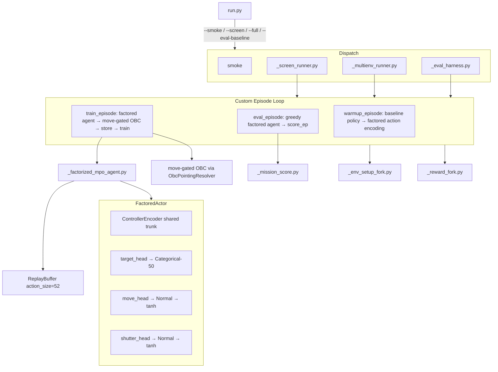

# Exp 14 Phase 1 Build Plan

## Pre-conditions verified
- Bin check: `pipeline_doc.py check` OK, doc in `1-built/`, `current_phase=1`, `phases."1".status: in_progress`.
- Production `episode_runner.py` **hardcodes `POLICY_RAW_DIM=2`** action parsing (lines 531-548): `action_vec[0]` = torque, `action_vec[1]` = shutter — a factored 52-dim action will crash this path. A **full custom episode loop** is mandatory.
- `build_baseline_overflight_setup` hardcodes `BASELINE_CLOUD_NUMBER_BOUNDS=(15,30)` inside `build_baseline_clouds` — cloud count override requires an env setup fork.
- `ControllerFeatureConfig.include_target_bearing_errors=False` by default — Exp 14 **must** enable it (50 scalars) or the Categorical head has no per-target signal.
- `OrbitConfig.sat_z_offset` exists and is wired through the stepper — no production edit needed.

## Confirmed decisions
- Bearing errors: **enabled** (`include_target_bearing_errors=True`, `include_captured_target_mask=True`, `include_capture_budget=True`) — adds 101 mission scalars for 50 targets.
- KL for Categorical: **entropy bonus only** — `entropy_coef * H[π_target]`; move+shutter keep existing decoupled KL.
- Episode loop: **full custom fork** for warmup, train, and eval.
- Replay on env switch (Stage B): **clear buffer**.
- Warmup actions stored as factored 52-dim: `[one_hot_50, move_gym∈{-1,+1}, shutter_gym∈{-1,+1}]`.
- Threshold convention: `move_gym > 0 → move=True`, `shutter_gym > 0 → shutter=True` (consistent with `shutter_cmd_from_gym` which maps `[-1,1]→[0,1]` then checks `>0.5`, equivalent to `x>0`).

## Architecture diagram



## Canonical action index constants (`_action_constants.py`)

**Single source of truth — every file that reads or writes the 52-dim action vector MUST import from here. Never hardcode index integers elsewhere.**

```python
# _action_constants.py
N_TARGETS      = 50            # number of navball target slots
N_ACTION_DIMS  = 52            # total replay buffer action width

# Slice indices — use these everywhere, never literals
TARGET_SLICE   = slice(0, 50)  # action[TARGET_SLICE]  → one-hot of applied target
MOVE_IDX       = 50            # action[MOVE_IDX]      → move_gym ∈ (-1, +1)
SHUTTER_IDX    = 51            # action[SHUTTER_IDX]   → shutter_gym ∈ (-1, +1)

# Threshold for boolean decode (both move and shutter)
BOOL_GYM_THRESHOLD = 0.0       # gym_value > 0  →  True

# Warmup and boolean encoding
GYM_TRUE  = +1.0
GYM_FALSE = -1.0
```

## Replay buffer action format — applied action, not predicted distribution

```
index   name            type/range        meaning
------  --------------- ----------------  ----------------------------------------
 0..49  target one-hot  float32 ∈ {0,1}   one_hot(sampled_target_idx, 50)
                        (exactly one 1.0) index of 1.0 = the target that was executed
 50     move_gym        float32 ∈ (-1,+1) tanh(move_z_sample);  > 0 → PD, ≤ 0 → coast
 51     shutter_gym     float32 ∈ (-1,+1) tanh(shutter_z_sample); > 0 → fire
```

**Stores the applied (sampled) action, not the predicted distribution.** This is the standard for off-policy RL (MPO, SAC):
- **Q-step:** `Q(s, a_buffer)` must equal Q of what actually generated reward `r` — the executed one-hot, not the softmax probs
- **M-step:** `log π_current(t_idx)` where `t_idx = argmax(one_hot)` is exact — no approximation needed

Both warmup (baseline, deterministic) and train (MPO, stochastic sample) use the same format. Warmup is the degenerate case where the policy was 100% confident, so its one-hot is the Dirac delta. A Categorical sample from a [0.1, 0.9] distribution that lands on idx 22 stores a one-hot at 22, not the [0.1, 0.9] vector.

## Full execution chain: softmax → sample → one-hot → actuator

```
Actor network:
  target_logits (50 floats, unconstrained)
        │ softmax
  target_probs  [… 0.10 at idx22, 0.90 at idx23 …]   ← distribution, NOT stored
        │ Categorical.sample()          (train, stochastic)
        │ OR argmax(probs)              (eval, greedy)
  target_idx = 23                       ← the decision; this is what gets executed
        │
        ├──► one_hot(target_idx=23, size=50)     → stored in replay buffer
        │    [0,0,…,0, 1.0 ,0,…,0]              at position 23
        │
        └──► anchor = target_anchor_xy_km[23]
                  │ target_boresight_angle_rad(sat_pos, anchor)
                  │ theta_target_to_u(theta_target, theta_orbit_rad)
                  ▼
             resolver.resolve_u_to_torque_nm(u, …)   → wheel_nm to stepper
```

## Encode / decode functions (must match exactly)

```python
def encode_applied_action(
    target_idx: int,     # the SAMPLED index (not argmax of probs, the actual sample)
    move_gym: float,     # tanh(move_z_sample) ∈ (-1,+1)
    shutter_gym: float,  # tanh(shutter_z_sample) ∈ (-1,+1)
) -> np.ndarray:
    """Build 52-dim replay action from applied (sampled) policy step. ONLY call this."""
    assert 0 <= target_idx < N_TARGETS, f"target_idx={target_idx} out of [0,{N_TARGETS})"
    action = np.zeros(N_ACTION_DIMS, dtype=np.float32)
    action[target_idx]  = 1.0          # one-hot at sampled index
    action[MOVE_IDX]    = float(move_gym)
    action[SHUTTER_IDX] = float(shutter_gym)
    return action

def encode_warmup_action(
    target_idx: int,  # baseline policy's active_target_index (deterministic)
    move: bool,       # True if baseline is in engage phase
    shutter: bool,    # True if baseline fires shutter this step
) -> np.ndarray:
    """Build 52-dim replay action from warmup baseline step. Same format, degenerate case."""
    # Baseline is deterministic → one-hot is exactly the same as encode_applied_action
    return encode_applied_action(
        target_idx=target_idx,
        move_gym=GYM_TRUE if move else GYM_FALSE,
        shutter_gym=GYM_TRUE if shutter else GYM_FALSE,
    )

def decode_target_idx(action: np.ndarray) -> int:
    """Recover the executed target: argmax of one-hot (= the stored 1.0 position)."""
    return int(np.argmax(action[TARGET_SLICE]))

def decode_move(action: np.ndarray) -> bool:
    return float(action[MOVE_IDX]) > BOOL_GYM_THRESHOLD

def decode_shutter(action: np.ndarray) -> bool:
    return float(action[SHUTTER_IDX]) > BOOL_GYM_THRESHOLD
```

**M-step log_prob (exact, no approximation):**
```python
t_idx = decode_target_idx(action_buffer)          # recover from stored one-hot
log_prob_target = dist_online["target"].log_prob(torch.tensor(t_idx))  # exact
```

## File layout

All files under `backend/scripts/experiments/ml_mpo_multienv_target_select/`:

```
_mission_score.py           slice 1
_env_setup_fork.py          slice 2 (env diversity)
_factorized_actor.py        slice 3 (neural network)
_factorized_mpo_agent.py    slice 3 (train loop)
_episode_loop_fork.py       slice 4 (custom loop replacing EpisodeRunner)
_reward_fork.py             slice 5
_profile_baseline.py        hparam arms, episode counts, feature config
_screen_runner.py           slice 6
_multienv_runner.py         slice 6
_eval_harness.py            slice 6
_run_guard.py               copy from ml_mpo_decoupled_dual_torque
_cpu_budget.py              copy
_sim_constants_fork.py      copy (dt 1.5/1.5)
_warmup_fingerprint_patch.py copy
run.py
SUBAGENT_CHARTER.md
README.md
profile.json
results/
```

---

## Slice 1 — `_mission_score.py`

Hook: [`simulation/capture_reward.py`](backend/simulation/capture_reward.py) already provides `applied_capture_reward_series` using `quality × coverage` multiplied by a configurable weight `k_capture`. Set `k_capture=1.0` (raw product, not shaped reward) to get `score_ep`.

```python
def compute_episode_mission_score(
    series: SimulationStateSeries,
    cmd_steps: tuple[int, ...],
) -> float:
    """sum(image_quality × primary_target_pixel_coverage) on budget-eligible applied captures."""
    arr = applied_capture_reward_series(series, cmd_steps=cmd_steps, k_capture=1.0)
    return float(arr.sum())

def aggregate_eval_scores(scores: list[float]) -> dict:
    return {
        "score_mean": float(np.mean(scores)),
        "score_std": float(np.std(scores)),
        "score_min": float(np.min(scores)),
        "score_max": float(np.max(scores)),
        "score_ep": scores,
    }
```

---

## Slice 2 — `_env_setup_fork.py`

Hook: `build_baseline_overflight_setup` + `cloud_formation_generator` from [`s01_utils/baseline_overflight.py`](backend/notebooks/s01/s01_utils/baseline_overflight.py). Fork `build_baseline_clouds` locally to override `cloud_number_bounds=(20,40)`. `OrbitConfig.sat_z_offset` is in [`simulation/setup_types.py`](backend/simulation/setup_types.py) — wire a sampled float per env.

```python
EXP14_BASE_SEED = 14000
TRAIN_ENV_COUNT = 10
N_TARGETS = 50
EVAL_SEEDS = [derive_seed(EXP14_BASE_SEED, "exp14_eval", i) for i in range(5)]

def build_exp14_clouds(segments, *, seed: int) -> tuple[Cloud, ...]:
    """Same geometry as baseline but cloud_number_bounds=(20, 40)."""
    # call cloud_formation_generator with overridden cloud_number_bounds

def build_exp14_env_setup(env_index: int) -> EnvironmentSetup:
    mission_seed = derive_seed(EXP14_BASE_SEED, "exp14_mission", env_index)
    cloud_seed   = derive_seed(EXP14_BASE_SEED, "exp14_cloud",   env_index)
    sat_z_rng    = np.random.default_rng(derive_seed(EXP14_BASE_SEED, "exp14_satz", env_index))
    sat_z_deg    = float(sat_z_rng.uniform(-5.0, 5.0))  # range TBD; extend if needed
    base = build_setup(seed=mission_seed, include_cameras=True)
    orbit = replace(base.orbit or OrbitConfig(), sat_z_offset=sat_z_deg * ureg.deg)
    segments = build_baseline_target_segments(n_targets=N_TARGETS)
    return replace(base, orbit=orbit,
                   target_areas=tuple(s.to_observation_target_area() for s in segments),
                   clouds=build_exp14_clouds(segments, seed=cloud_seed))
```

For the fixed screen env: `build_exp14_env_setup_fixed(mission_seed=7, cloud_seed=7)` (no `sat_z_offset` for screen).

---

## Slice 3 — `_factorized_actor.py` and `_factorized_mpo_agent.py`

### `_factorized_actor.py`

Reuses [`autonomous_control/controller_encoder.py`](backend/autonomous_control/controller_encoder.py) (shared trunk). Head dims: target = `n_targets` logits; move + shutter = each 2 (mu, log_std).

```python
class FactoredActor(nn.Module):
    N_CONTINUOUS = 2  # move + shutter

    def __init__(self, layout, n_targets, config):
        self.encoder = ControllerEncoder(layout, config, activation=config.activation_actor)
        d = self.encoder.output_dim
        self.target_head  = nn.Linear(d, n_targets)
        self.move_head    = nn.Linear(d, 2)   # (mu, log_std)
        self.shutter_head = nn.Linear(d, 2)

    def forward(self, scalars, vision) -> dict:
        """Returns dict of distributions: target (Categorical), move (Normal), shutter (Normal)."""

    def sample_stored_action(self, dists, *, greedy=False) -> tuple[torch.Tensor, dict]:
        """
        Returns (action_52_float, extras).
        action_52 = [one_hot_50, move_gym, shutter_gym]
        extras contains t_idx, move_z, sh_z for log_prob computation during M-step.
        """

    def log_prob(self, dists, action_52: torch.Tensor) -> torch.Tensor:
        """
        log π_target(argmax(action[:50]))
        + log π_move(arctanh(action[50])) - log(1 - action[50]² + 1e-6)
        + log π_shutter(arctanh(action[51])) - log(1 - action[51]² + 1e-6)
        Shape: (batch,)
        """
```

### `_factorized_mpo_agent.py`

Fork of [`autonomous_control/controller_agent.py`](backend/autonomous_control/controller_agent.py) `MPOAgent`. Key changes:

- `action_size = n_targets + 2 = 52`
- `pi` / `pi_target` = `FactoredActor` (not `Actor`)
- `buffer = ReplayBuffer(size, layout, action_size=52, device)` — unchanged class, new size
- `get_action(obs, *, train)` → 52-dim numpy array
- `store((obs, action_52, reward, next_obs, done))` → `buffer.store(obs, next_obs, action_52, reward, done)`
- `train()` E-step samples factored actions; M-step uses `FactoredActor.log_prob()`

**E-step (replacing lines 207-223 in production):**
```python
# sample num_samples_pi factored actions per batch obs
actions_52_samples = stack [pi.sample_stored_action(dists) for _ in range(num_samples_pi)]
# shape (num_samples_pi, batch, 52)
# flatten → (num_samples_pi*batch, 52) → Q → weights
```

**M-step log_prob (replacing lines 257-259 in production):**
```python
# action sampled from E-step; extract dims
log_prob_samples = pi.log_prob(dist_online, actions_52_samples)
# shape (num_samples_pi, batch)
```

**KL (move+shutter Gaussian, replacing lines 231-247 in production):**
```python
# Stack move+shutter mu/sigma from both online and target actors into Normal((batch,2))
dist_continuous_online = Normal(cat([move_mu, sh_mu], -1), cat([move_sig, sh_sig], -1))
dist_continuous_ref    = Normal(cat([move_mu_ref, sh_mu_ref], -1), ...)
# apply existing decoupled kl_mu / kl_sigma formulas unchanged
```

**Entropy bonus (added to pi_loss):**
```python
H_target = dists["target"].entropy()  # (batch,) — torch.distributions.Categorical has .entropy()
pi_loss += ... - self.config.entropy_coef * H_target.mean()
```

`entropy_coef` added to `_profile_baseline.py` arm specs (not in MPOConfig, fork-local).

---

## Slice 4 — `_episode_loop_fork.py`

Custom loop that **replaces** `EpisodeRunner.run()` for all modes. Uses:
- [`simulation/obc_pointing_request.py`](backend/simulation/obc_pointing_request.py) `ObcPointingResolver` for move-gated PD
- [`autonomous_control/episode_runner.py`](backend/autonomous_control/episode_runner.py) stepper initialisation (reuse `EpisodeRunner._build_stepper()` or replicate 50-line init)
- Target anchors: `resolve_target_anchor_xy_km(setup.resolve().target_areas, earth_radius_km=...)` from [`autonomous_control/controller_observation.py`](backend/autonomous_control/controller_observation.py)

**Warmup episode loop (pseudocode):**
```python
from _action_constants import encode_warmup_action, decode_target_idx, decode_move, decode_shutter

policy = build_baseline_overflight_policy(setup)
for each controller tick:
    state = stepper.current_timestep_state()
    action_nm, take_pic = policy.step(state)          # baseline PD torque + shutter
    # encode using the canonical function — no raw indices in this file
    action_52 = encode_warmup_action(
        target_idx=policy.active_target_index,
        move=(policy.pointing_phase == "engage"),
        shutter=take_pic,
    )
    stepper.step(wheel_torque_cmd_nm=action_nm, ...)
    agent.store((obs, action_52, reward, next_obs, done))
```

**Train episode loop (pseudocode):**
```python
from _action_constants import decode_target_idx, decode_move, decode_shutter

resolver = ObcPointingResolver(tau_max_nm, sat_inertia)
resolver.reset_episode(theta_orbit_rad=...)   # MUST call at episode start

for each controller tick:
    state = stepper.current_timestep_state()
    action_52 = agent.get_action(obs, train=True)  # returns 52-dim via encode_policy_action

    # decode using canonical functions — never read raw indices in this file
    target_idx  = decode_target_idx(action_52)     # argmax of probs[0:50]
    move        = decode_move(action_52)            # action[MOVE_IDX=50] > 0
    shutter     = decode_shutter(action_52)         # action[SHUTTER_IDX=51] > 0

    anchor = target_anchor_xy_km[target_idx]
    if move:
        u = theta_target_to_u(
            theta_target_rad=target_boresight_angle_rad(sat_pos, anchor),
            theta_orbit_rad=float(state.theta_orbit_rad),
        )
        wheel_nm = resolver.resolve_u_to_torque_nm(u=u, ...)
    else:
        wheel_nm = 0.0   # coast — zero torque, not hold

    take_picture = shutter
    stepper.step(wheel_torque_cmd_nm=wheel_nm, agent_pointing_cmd_u=u if move else None)
    agent.store((obs, action_52, reward, next_obs, done))
    agent.train()
```

**Eval episode** — same as train but `train=False`, no store/train; collect `cmd_steps` for `score_ep`.

---

## Slice 5 — `_reward_fork.py`

Implements the Phase 0 shaping weights via production reward hooks:

```python
# reward = α·score_gain + β·successful_capture_bonus − γ·missed_opportunity − δ·instability_penalty − ε·torque_penalty
ALPHA, BETA, GAMMA, DELTA, EPSILON = 1.0, 0.5, 0.2, 0.1, 0.01
```

Wire by patching or configuring `RewardConfig` fields that map to the canonical reward functions in [`autonomous_control/reward.py`](backend/autonomous_control/reward.py). If production knobs don't cover exactly these weights, a `_reward_fork.py` function intercepts and re-weights per tick (same pattern as Exp 8 `_reward_fork.py`).

---

## Slice 6 — `_profile_baseline.py`, `_screen_runner.py`, `_multienv_runner.py`, `_eval_harness.py`

### `_profile_baseline.py`
```python
@dataclass(frozen=True)
class ScreenArmSpec:
    arm_id: str
    learning_rate_pi: float
    learning_rate_q: float
    batch_size: int
    entropy_coef: float   # fork-local; not in MPOConfig

SCREEN_ARMS = [
    ScreenArmSpec("hp_default",      1.5e-4, 4.5e-4, 256, 0.01),
    ScreenArmSpec("hp_conservative", 5e-5,   1.5e-4, 256, 0.01),
    ScreenArmSpec("hp_mid_batch",    1.5e-4, 4.5e-4, 512, 0.01),
    ScreenArmSpec("hp_aggressive",   4.5e-4, 1e-3,   512, 0.02),
    ScreenArmSpec("hp_explore",      1.5e-4, 4.5e-4, 256, 0.05),
]

FEATURE_CONFIG = ControllerFeatureConfig(
    include_target_bearing_errors=True,
    include_captured_target_mask=True,
    include_capture_budget=True,
)
```
Frozen from Exp 8: `decoupled_kl=True`, `num_samples_q=80`, `num_samples_pi=40`, `dt=1.5/1.5`.

### `_screen_runner.py`
Pattern: [`ml_sac_hparam_grid/_hparam_runner.py`](backend/scripts/experiments/ml_sac_hparam_grid/_hparam_runner.py). Per arm: 5 warmup + 20 train + 1 eval on fixed env. Output: `results/arm_kpis/{arm_id}.json` + `results/screen_summary.json`. Clear buffer between arms. Winner: rank by train return at ep 20, tie-break eval return then policy entropy.

### `_multienv_runner.py`
Stage B: 10 train envs × (5 warmup + 30 train) = 350 ep. Clear buffer on env switch. Track best eval `score_mean` checkpoint (not best return). Output: `results/stage_b_summary.json`.

### `_eval_harness.py`
```python
EVAL_ENV_SEEDS = 5  # derive_seed(EXP14_BASE_SEED, "exp14_eval", i)

def run_baseline_eval(n_seeds=5) -> dict:
    """Run SequentialTargetBaselinePolicy on all 5 eval seeds → score_mean."""

def run_treatment_eval(agent, checkpoint_path, n_seeds=5) -> dict:
    """Load checkpoint, run greedy factored agent on same 5 seeds → score_mean."""
```
Output: `results/eval_comparison.json` with `score_mean_baseline`, `score_mean_treatment`, `delta_score_mean`, per-seed `score_ep[]` for both.

---

## `run.py` entry points

```powershell
# Smoke (imports + CUDA + 1 warmup + 2 train + score_ep logged)
python run.py --smoke [--allow-cpu]

# Phase 2 Stage A
python run.py --screen [--arms hp_default,hp_explore] [--show-progress]

# Phase 2 Stage B (after screen winner frozen)
python run.py --full [--show-progress]

# Baseline reference (run once before treatment)
python run.py --eval-baseline
```

---

## Conversion verification (`--verify` mode, runs before `--smoke`)

Run as `python run.py --verify`. All 7 must pass before any training code is exercised.

```python
# ── CHECK A: softmax → sample → one-hot (the full policy-to-buffer chain) ──────────────

# Simulate policy output: probs with runner-up at 22, winner at 23
probs = torch.zeros(50); probs[22] = 0.1; probs[23] = 0.9
dist = torch.distributions.Categorical(probs=probs)

# The sample in this test is forced to 23 (as if the random draw landed there)
sampled_idx = 23
move_z = 0.88; shutter_z = -0.5
move_gym    = float(torch.tanh(torch.tensor(move_z)))    # ≈ +0.707
shutter_gym = float(torch.tanh(torch.tensor(shutter_z))) # ≈ -0.462

action = encode_applied_action(
    target_idx=sampled_idx,
    move_gym=move_gym,
    shutter_gym=shutter_gym,
)

# ── CHECK B: one-hot layout and index positions ──────────────────────────────────────
assert action.shape == (52,)
assert action[23] == 1.0                               # sampled idx = 23 → one-hot at 23
assert action[22] == 0.0                               # runner-up NOT stored (probs not in buffer)
assert action[:50].sum() == pytest.approx(1.0)         # exactly one 1.0 in target slice
assert action[MOVE_IDX]    == pytest.approx(move_gym)  # MOVE_IDX=50, not 51
assert action[SHUTTER_IDX] == pytest.approx(shutter_gym) # SHUTTER_IDX=51, not 50

# ── CHECK C: decode round-trip ────────────────────────────────────────────────────────
assert decode_target_idx(action) == 23    # argmax of one-hot recovers sampled index
assert decode_move(action)    is True     # move_gym ≈ +0.707 > 0
assert decode_shutter(action) is False   # shutter_gym ≈ -0.462 ≤ 0

# ── CHECK D: MOVE/SHUTTER swap detection ──────────────────────────────────────────────
# If MOVE_IDX and SHUTTER_IDX were swapped in constants, this test catches it
swapped = action.copy()
swapped[MOVE_IDX], swapped[SHUTTER_IDX] = swapped[SHUTTER_IDX], swapped[MOVE_IDX]
assert decode_move(swapped)    is False   # was shutter_gym < 0
assert decode_shutter(swapped) is True    # was move_gym > 0

# ── CHECK E: actuator mapping — one-hot → OBC resolver produces bounded torque ────────
target_anchor = target_anchor_xy_km[decode_target_idx(action)]  # shape (2,)
sat_pos = np.array([0.0, 6871.0])  # test position, on orbit circle
theta_orbit = np.pi / 4
theta_target = target_boresight_angle_rad(sat_pos, target_anchor)
u = theta_target_to_u(theta_target_rad=theta_target, theta_orbit_rad=theta_orbit)
assert -1.0 <= u <= 1.0, f"u out of [-1,1]: {u}"  # OBC resolver always clips to safe range

# ── CHECK F: warmup format matches train format (same one-hot structure) ──────────────
wu = encode_warmup_action(target_idx=7, move=True, shutter=False)
assert wu[7] == 1.0 and wu[:50].sum() == pytest.approx(1.0)
assert wu[MOVE_IDX]    == GYM_TRUE   # +1.0
assert wu[SHUTTER_IDX] == GYM_FALSE  # -1.0
assert decode_target_idx(wu) == 7
assert decode_move(wu)    is True
assert decode_shutter(wu) is False

# ── CHECK G: score pipeline produces finite non-zero on baseline ──────────────────────
series, cmd_steps = run_one_baseline_episode(fixed_env)
score = compute_episode_mission_score(series, cmd_steps)
assert score > 0.0, f"Baseline score_ep is {score} — capture pipeline not wired"
```

## Smoke pass criteria (Phase 1 close gate)

1. `python run.py --verify` passes all 6 checks
2. `python run.py --smoke --allow-cpu` exits 0
3. `FactoredActor.forward()` produces 3 distributions without shape error
4. One `FactoredMPOAgent.train()` step returns a metrics dict (no NaN loss)
5. Episode completes: move-gated torque at `move=True` steps, zero at `move=False`
6. `results/smoke.json` contains finite `score_ep`

---

## SUBAGENT_CHARTER

- Protected (import only): `backend/autonomous_control/**`, `backend/simulation/**`, `backend/render/**`, `backend/notebooks/s01/**`
- Editable: `backend/scripts/experiments/ml_mpo_multienv_target_select/**`, pipeline doc Phase 1 block (at `/document-experiment-step`)
- Mutex: `pipeline_run_guard` slug `ml_mpo_multienv_target_select`

---

## Open questions to resolve before/during build

- **`sat_z_offset` range**: `±5°` assumed; confirm acceptable or adjust in `_env_setup_fork.py`.
- **Captured target mask**: `include_captured_target_mask=True` adds 50 more scalars; can drop if obs too wide.
- **Screen winner persistence**: `screen_summary.json` records `winner_arm_id`; `--full` reads it — or pass `--arm hp_default` explicitly to bypass.

---

## Operator dissatisfaction + live-debug record (for all agents)

### What the operator is unhappy with

- The experiment is perceived as "almost nothing works" despite substantial implementation effort.
- Runtime behavior does not inspire confidence: passing build checks did not translate to stable Stage A execution.
- Code surface is too large for fast human verification (many fork files, custom loop, custom agent, custom runners).
- Debugging happened reactively during runs, not from a small trusted baseline.
- There is concern that failures are systemic (architecture/integration), not only local syntax or index bugs.

### What was already debugged on the fly

- **Action encoding contract validated:** `results/verify.json` shows checks A-H passed (sample->one-hot, index layout, decode roundtrip, warmup format, actuator boundedness, baseline score positive).
- **Smoke run passed:** `results/smoke.json` reports `passed: true`, finite losses, and nonzero warmup/eval mission score.
- **Warmup quality gate passed:** `results/warmup_preview.json` reports `passed: true` with mission score and capture count above gate.
- **Critical runtime failure still occurs:** `results/run_error.json` shows Stage A aborted with `OSError: [Errno 22] Invalid argument` from `tqdm` progress display path.

### Why this likely goes deeper than one bug

- The project currently has two layers of truth:
  1) local unit/smoke/verify checks that pass, and
  2) integrated screen/full execution that still fails or underperforms.
- The training stack combines many simultaneous forks (actor, MPO internals, episode loop, env setup, runners, artifacts/progress). This raises coupling risk and makes root cause isolation difficult.
- Smoke signal is weak for learning quality: in `results/smoke.json`, warmup mission score is positive while train mission scores are `0.0`, suggesting possible control/credit assignment misalignment even when execution does not crash.
- Operator confidence failure is therefore both technical and process-level: too much changed at once, insufficiently staged integration gates.

### Rebuild direction (minimum viable reconstruction)

1. **Stabilize execution path first:** disable/guard fragile progress-display writes so Stage A runs end-to-end without terminal I/O exceptions.
2. **Shrink the active surface:** run one-arm, one-env, no-artifact, no-fancy-progress baseline with the exact same core loop and agent.
3. **Promote one gate at a time:** (a) no crash, (b) nonzero train mission score trend, (c) deterministic replayable run, then add multi-arm/multi-env.
4. **Separate "works" from "better":** first prove pipeline stability; only then evaluate whether factorized policy beats baseline.
5. **Document each gate result in artifacts:** each rebuild step must emit one small JSON verdict before moving to the next step.

### Non-goals during rebuild

- No new feature expansion.
- No broad refactor of unrelated systems.
- No additional forks unless required to remove ambiguity in ownership.

### Working assumption for all agents

Treat this as an integration-stability recovery task, not a hyperparameter tuning task.  
Until stability gates pass, prioritize reducing moving parts over adding capability.
