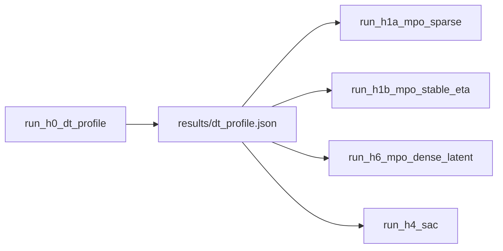

# ML algorithm overnight hypothesis cycle

**Plan file:** [`.cursor/plans/inbox/ml_overnight_hypotheses_00b5b396.plan.md`](.cursor/plans/inbox/ml_overnight_hypotheses_00b5b396.plan.md)

## User decisions (locked)

| Decision | Choice |
|----------|--------|
| Train episodes | H0 ≥2× speed → **10**; else **7** (not 5); no valid dt → **abort** |
| H6 shutter scale | **10×** applied (`k_applied = 1_000`); latent dense `k = 100` every step |
| H1 MPO | **Two runs:** H1a sparse + H1b fixed-η (no dual optimizer) |
| Videos | Top-3 train + all 2 eval per phase (full) |
| No CUDA | Smoke **aborts** (no CPU overnight unless explicit `--allow-cpu`) |
| Queue trim | Drop H2, H3, H5; keep H0, H1a/b, H6, H4 |

## Goal

By the time you get home: **one command** runs the full cycle under [`backend/scripts/experiments/ml_algo_overnight/`](backend/scripts/experiments/ml_algo_overnight/). No per-H scheduling — phases are Python functions called from [`run_overnight.py`](backend/scripts/experiments/ml_algo_overnight/run_overnight.py). Production stays **read-only**; forks live in the experiment folder.

Morning readout: ranked JSON + analysis cards; pick the strongest arm (e.g. V-MPO) for a deep follow-up.

---

## What stays fixed (frozen contract)

| Knob | Fixed value | Source |
|------|-------------|--------|
| **Seed** | `7` | [`ml_learning_signal/_frozen_baseline.py`](backend/scripts/experiments/ml_learning_signal/_frozen_baseline.py) |
| **Obs / features** | `S01_TRAINING_FEATURE_CONFIG` — attitude(2) + orbit(2) + dual vision lines + budget + **50 mask** + **50 bearing** → **406-dim** | [`training_workflow.py`](backend/notebooks/s01/s01_utils/training_workflow.py) L86–102 |
| **Action** | `[torque_norm, shutter_gym]` ∈ `[-1,1]²` | [`action_adapter.py`](backend/autonomous_control/action_adapter.py) |
| **Reward (H1–H5, default)** | **Sparse capture**: applied shutter credit only + shutter-waste + torque²; distance off; **latent computed but not in total** | [`compute_reward`](backend/autonomous_control/reward.py) L384–394 |
| **Reward (H6 only)** | **Dense latent + amplified shutter** — see [H6 section](#h6--mpo--dense-latent-reward-falsify-needle-in-haystack) | experiment [`_reward_fork.py`](backend/scripts/experiments/ml_algo_overnight/_reward_fork.py) |
| **Mission / env** | S01 multi-target, clouds, attitude safety on, external torque | unchanged |
| **Warmup** | 5 episodes, nb07 baseline overflight, strided targets (`warmup_targets_per_episode=10`), **controller-interval store only** | Already enforced in [`preload_warmup_buffer_from_episodes`](backend/autonomous_control/notebook_warmup_bundle_cache.py) L166–174 and [`episode_runner`](backend/autonomous_control/episode_runner.py) `pilot_command_issued` gate |
| **Learning cadence** | inline step learning: `train_every_n_steps=1`, `updates_per_step=1` | no megabatch |
| **Eval** | **2 episodes**, `train=False` → actor **mean** action ([`get_action` L291–292](backend/autonomous_control/controller_agent.py)), full horizon (`early_stop_on_budget_exhausted=False`), no `train()` | [`run_eval`](backend/notebooks/s01/s01_utils/training_workflow.py) |
| **Network reuse** | Same `Actor` encoder/CNN from [`controller_actor.py`](backend/autonomous_control/controller_actor.py); same obs layout | fair cross-algo comparison |
| **Shared hparams** | `batch_size=256`, `gamma=0.99`, buffer `50_000` (where used) | [`mpo_config.py`](backend/autonomous_control/mpo_config.py) |
| **Runtime** | `conda activate auto-sat`, CUDA if available, serial jobs via `.experiment_run.lock` | reuse [`_run_guard.py`](backend/scripts/experiments/ml_learning_signal/_run_guard.py) |

**Also fix for the cycle (experiment-local, not production):**

- **Coarse sim profile** chosen by H0 (written to `results/dt_profile.json` → consumed by H1–H5).
- **Warmup cache rebuild** whenever `dt` / controller interval changes (`rebuild_warmup_bundle_cache=True`) because fingerprint today omits `simulation_timestep` ([`warmup_fingerprint_payload`](backend/autonomous_control/notebook_warmup_bundle_cache.py) — experiment fork extends fingerprint with `sim_dt_s` + `controller_interval_s`).
- **`eval_episodes=2`** in frozen config (current ml_learning_signal frozen uses `0`).
- **`background_artifacts=True`** during phases so existing [`BackgroundArtifactWorker`](backend/utils/ml_training/training_artifact_worker.py) handles plots; videos scheduled explicitly post-phase (see below).
- **`collect_states=False`** during train/eval hot path (speed); **video replay** re-runs selected episodes with `collect_states=True` after phase completes.
- **Train episode count:** H0 ≥2× speed vs `(0.4, 0.8)` ref → **10**; else **7**; no parity-passing dt → abort queue (see H0).

---

## What varies (one logical change per script)

- **H1a, H1b, H6:** MPO; H6 varies reward (dense latent); H1a/H1b sparse (H1b fixed η).
- **Never varied:** obs dims, action space, mission, warmup policy (nb07 baseline), learning cadence.

---

## Preliminary: H0 — dt / controller profile sweep

**Script:** `run_h0_dt_profile.py`  
**Research pillar:** none (throughput gate for overnight budget)

**Candidates** (sim dt = effective controller interval to avoid scheduler warnings):

```text
(0.4 s, 0.8 s effective)  # production reference
(0.8 s, 0.8 s)
(1.0 s, 1.0 s)
(1.5 s, 1.5 s)
```

**Mechanism:** experiment fork [`_sim_constants_fork.py`](backend/scripts/experiments/ml_algo_overnight/_sim_constants_fork.py) monkeypatches `SIMULATION.simulation_timestep` and `SIMULATION.controller_update_interval` before any stepper/env build (pattern: [`sensor_kernel_fork.py`](backend/scripts/experiments/sensor_ray_batch/c_fuse_cameras/sensor_kernel_fork.py)).

**Per candidate, measure on CUDA:**

1. **Parity:** 1 deterministic baseline-overflight warmup episode → capture count / return vs reference (must stay in same ballpark; reject dt if captures collapse to 0).
2. **Speed:** 1 MPO train episode (warmup skipped or from small cache) → `wall_s`, `steps`, `n_train_updates`, `steps_per_s`.

**Selection rule:**

- Pick **largest dt passing parity** with best `wall_s`.
- If best coarse dt gives **≥2×** speed vs `(0.4, 0.8)` reference → `TRAIN_EPISODES=10`
- Else → `TRAIN_EPISODES=7`
- No candidate passes parity → **abort** overnight (write `dt_profile.json` with `aborted: true`)



**Queue order:** H0 → **H1a** → **H1b** → **H6** → **H4**.

---

## Success KPI — primary goal: continuous improvement mode

**Overnight bar (all arms):** exit the “flat zero” regime and show **evidence the policy is learning**, not beat nb07 baseline (~89). Baseline superiority on eval is **nice-to-have** for this cycle.

Three tiers in `_runner_common.py`:

```python
def evaluate_learning_mode(train_returns, eval_returns, *, learning_stats) -> dict:
    eps = [float(r) for r in train_returns]
    n = len(eps)
    # Tier 1 — minimum viable learning (PRIMARY overnight pass)
    any_nonzero = any(r != 0.0 for r in eps)
    improving = n >= 2 and (eps[-1] > eps[0] or max(eps[1:]) > eps[0])
    kl_finite = learning_stats.get("kl_mean_last", float("inf")) < 1e4  # MPO arms
    learning_mode = any_nonzero and improving and kl_finite

    # Tier 2 — strong lead (stretch; prior ml_learning_signal bar)
    strong_lead = (
        all(r > 0 for r in eps)
        and improving
        and (mean(eval_returns) > 0 if eval_returns else False)
    )

    # Tier 3 — beats baseline reference (bonus, not required)
    beats_baseline = mean(eval_returns) > BASELINE_WARMUP_RETURN_MEAN if eval_returns else False

    return {
        "learning_mode": learning_mode,
        "strong_lead": strong_lead,
        "beats_baseline": beats_baseline,
        "train_returns": eps,
        "eval_return_mean": mean(eval_returns) if eval_returns else None,
    }
```

**Verdict mapping (overnight):**

| Verdict | Condition |
|---------|-----------|
| **`supported`** | `learning_mode == True` |
| **`inconclusive`** | partial signal (non-zero but flat, or improving but KL blow-up) |
| **`falsified`** | all-zero train returns through last ep, same as branch A |

**H6 additionally** log `mean_positive_reward_steps`, `latent_return_integral`, unique targets captured — dense credit should make Tier 1 easier than H1.

Secondary diagnostics: `action_diagnostics`, KL/η, shutter-at-reward fraction, budget exhaustion step.

Reference warmup mean: **≈89** sparse reward — **reference only**, not the pass gate ([`BASELINE_WARMUP_RETURN_MEAN`](backend/scripts/experiments/ml_learning_signal/_frozen_baseline.py)).

---

## H6 — MPO + dense latent reward (falsify needle-in-haystack)

**Script:** `run_h6_mpo_dense_latent.py`  
**Hypothesis ID:** `mpo_dense_latent_10x_shutter`  
**Research pillar:** dense reward / potential shaping for sparse EO capture (cf. [`machine-learning.md`](docs/presentation/machine-learning.md) latent vs applied semantics; Ng et al. potential-based shaping as follow-up if local optima appears)

**Problem under test:** Branch A showed 0.14% positive transitions in replay — MPO may be fine but **credit assignment is starved**. Latent capture is already computed every step but **excluded from `total`** in production [`compute_reward`](backend/autonomous_control/reward.py):

```384:394:backend/autonomous_control/reward.py
    total = (
        ...
        + components["image_quality_capture_reward"]   # applied, shutter-only
        + components["shutter_waste_penalty"]
        + components["torque_effort_penalty"]
    )
    # latent_capture_reward computed above but NOT added
```

**Treatment (experiment fork only — `_reward_fork.py`):**

| Term | Production (H1) | H6 fork |
|------|-----------------|---------|
| **Dense latent** | computed, **not in total** | **`total += latent_capture_reward` every step** — rewards continuous pointing over visible targets with good coverage/quality and low cloud block |
| **Applied (shutter)** | `k = 100` | **`k_applied = 10 × 100 = 1_000`** |
| **Latent scale** | `k = 100` (diagnostic) | keep **`k_latent = 100`** (dense signal without extra 100× — avoids total reward explosion) |
| Penalties | waste + torque² | unchanged |

Formula unchanged: `latent = k × coverage × quality × (1 − cloud_frac)` per step when target visible.

**Expected behavior:**

- Baseline overflight warmup under H6 reward should show **much higher return** (dense integral over pass) — still the reference for *scheduling*, not necessarily beatable on eval.
- MPO should get **gradient every controller tick** toward “point at interesting visible targets, minimize cloud,” then learn shutter timing from amplified spikes.
- **Known risk (accepted):** local optimum — linger on one target for dense credit, slow transitions, miss multi-target schedule. Monitor: unique targets captured, `target_already_imaged` mask fill rate, latent per-target dwell time. A local optimum here is still a win vs current all-zero learning.

**Critical: warmup cache must rebuild for H6**

Cached transitions store **`simulation_reward` from rollout** ([`preload_warmup_buffer_from_episodes`](backend/autonomous_control/notebook_warmup_bundle_cache.py) L177). Sparse-cache preload + dense train = **label mismatch**. H6 run config:

- `rebuild_warmup_bundle_cache=True`
- Extend experiment fingerprint with `reward_mode: "dense_latent_10x_applied"`
- Optional: skip buffer preload entirely and rely on on-policy train only (simpler but loses demo transitions) — **prefer rebuild** so MPO still has positive dense examples.

**Verdict:**

- `supported` if **`learning_mode`** true (improving train curve + finite KL/η) — baseline beat **not** required.
- `inconclusive` if non-zero but flat or unstable η.
- `falsified` if still all-zero train returns despite dense credit → sparsity was not the only blocker.
- Compare directly to H1 on same dt profile.

---

## Trimmed overnight queue (confirmed)

**In queue:** H0 → H1a → H1b → H6 → H4  
**Deferred:** H2 PPO, H3 V-MPO, H5 P-DQN (morning deep-dive if SAC or dense-MPO shows `learning_mode`)

| Dropped | Why |
|---------|-----|
| **H3 V-MPO** | Largest build (3.5–5 h); unpported; on-policy story covered later if H4/H6 learn |
| **H5 P-DQN** | Hybrid shutter head (2.5–3.5 h); plan/control split is phase 2 |
| **H2 PPO** | On-policy overlap with deferred V-MPO; warmup/buffer edge cases; SAC tests “not MPO” more directly |

**Revised estimates:** impl **~8–10 h**; GPU **~3–4.5 h** optimistic (smoke + H0 + 4 treatment phases incl. H1b).

---

## Six overnight hypothesis scripts (+ H0 preflight)

Each phase is a function in `_phases/`, invoked only from `run_overnight.py`.

Shared runner [`_runner_common.py`](backend/scripts/experiments/ml_algo_overnight/_runner_common.py) — generalizes `run_training_slice` to:

- apply `_sim_constants_fork.apply_chosen_dt_profile()`
- `build_training_workflow_setup` + **inject fork agent** via `agent_factory(env, config) -> AgentProtocol`
- `run_training_workflow` with `eval_episodes=2`
- emit fixed-contract JSON + 8-section analysis card

**Agent protocol** (duck-typed; production `episode_runner` already uses `hasattr(agent, "train"|"store")`):

- `get_action(obs, train)`, `train()`, `store(transition)`, `buffer`, `config`, optional `metrics`

Fork agents live under [`agents/`](backend/scripts/experiments/ml_algo_overnight/agents/) — **do not edit** [`controller_agent.py`](backend/autonomous_control/controller_agent.py) during the cycle.

| Phase | Hypothesis ID | Research pillar | Implementation sketch |
|-------|---------------|-----------------|------------------------|
| **H1a** | `mpo_sparse` | MPO arXiv:1806.06920 | Production `MPOAgent` + sparse reward |
| **H1b** | `mpo_sparse_stable_eta` | MPO stability | Same as H1a; `learning_rate_eta=0`, fixed `log_eta` |
| **H6** | `mpo_dense_latent_10x_shutter` | Dense shaping for sparse EO | Same MPO + `_reward_fork.py`; rebuild warmup cache |
| **H4** | `sac_entropy_fixed_alpha` | SAC (2018) | Twin Q + Actor; fixed α=0.2; sparse reward |

~~H2 PPO~~, ~~H3 V-MPO~~, ~~H5 P-DQN~~ — documented under `docs/deferred_phases.md` in experiment folder.

Each phase: `write_hypothesis_result` → `results/hN_*.json` + analysis card; on exception → `results/hN_error.json` and continue.

---

## Experiment folder layout (to create)

```text
backend/scripts/experiments/ml_algo_overnight/
  README.md
  SUBAGENT_CHARTER.md
  H0-dt-profile.md … H6-dense-latent.md
  run_overnight.py               # ONLY user-facing entry
  _frozen_baseline.py
  _sim_constants_fork.py
  _reward_fork.py
  _runner_common.py
  _run_guard.py
  _phases/
    smoke.py
    h0_dt.py
    h1_mpo_sparse.py
    h6_mpo_dense_latent.py
    h4_sac.py
  agents/
    sac_agent_fork.py
  results/
    overnight.log
    overnight_summary.json
    dt_profile.json
    smoke.json
```

No `run_h1.py` … `run_h6.py` at top level — avoids scheduling confusion.

## Orchestrator design (one command, no scheduling)

**Entry:** `run_overnight.py` only. `_phases/*.py` hold logic; **not** separate scripts you queue.

```text
run_overnight.py
  ├── phase_smoke()          # ~2–3 min; abort whole run on fail
  ├── phase_h0_dt()          # picks dt + train_episodes → dt_profile.json
  ├── for phase in [H1a, H1b, H6, H4]:
  │     try: run_hypothesis_phase(phase)
  │     except: log traceback → results/hN_error.json → continue
  └── write overnight_summary.json   # ranks all phases by learning_mode
```

**Phase independence (same seed 7):**

| Per phase | Fresh | Shared |
|-----------|-------|--------|
| Agent weights | yes — new init every H | — |
| `run_dir` / `config.json` / `episodes.csv` | yes — via [`create_run_dir`](backend/utils/ml_training/ml_training_utils.py) (`ml_overnight_h1_…`) | — |
| `seed=7` | — | yes — same mission randomness |
| `dt_profile.json` from H0 | — | yes |
| Warmup bundle cache | rebuild when reward/dt fingerprint differs | same cache **read** when fingerprint matches |

One phase crashing does **not** stop later phases (`try/except` + error JSON).

**Smoke test (`phase_smoke`) before H0:**

1. `torch.cuda.is_available()` — **abort** if false (optional `--allow-cpu` for debug only)
2. Import chain: workflow, MPOAgent, render export
3. Apply chosen/default dt fork; build env
4. **Truncated** warmup rollout (~50 sim steps or budget-safe mini episode)
5. One `agent.train()` if buffer has enough samples (or preload 256 fake — prefer real mini warmup)
6. One video encode probe (tiny series → `results/smoke_test.mp4`)
7. Write `results/smoke.json` with timings

If smoke fails → **exit 1**, no overnight burn.

**Logging:** append human lines to `results/overnight.log`; each phase also uses normal [`run_log.md`](backend/utils/ml_training/ml_training_utils.py), `episodes.csv`, `summary_metrics.json`, `agent.pt` checkpoint in its own `run_dir` under `backend/autonomous_control/models/`.

**Videos (per phase H1a, H1b, H6, H4):**

After train+eval, before moving to next phase:

| Clip | Selection | Output path |
|------|-----------|-------------|
| Train top-3 | 3 highest `episode_return` train episodes | `{run_dir}/videos/train_ep_{idx}_rank{r}.mp4` |
| Eval all | both eval episodes (2) | `{run_dir}/videos/eval_ep_{idx}.mp4` |

Implementation: **replay export** — re-run episode with same seed derivation (`derive_seed(7, phase, ep_idx)`), `mode=eval`, `collect_states=True`, `train_updates_per_step=0`, then [`export_training_episode_video_sync`](backend/utils/ml_training/training_run_artifacts.py). Avoids storing states for every train step overnight.

Paths recorded in phase JSON under `artifacts.videos`.

**Disk note:** up to 5 MP4s × 4 phases ≈ 20 videos; smoke validates ffmpeg first.

---

## How you run it (one command, then sleep)

**Status today:** plan only — folder does not exist yet. Say **execute the plan** to build it.

```powershell
conda activate auto-sat; python backend/scripts/experiments/ml_algo_overnight/run_overnight.py
```

Optional:

```powershell
python .../run_overnight.py --smoke-only          # validate setup, go to bed manually later
python .../run_overnight.py --from h6             # resume (skip completed phases if json exists)
python .../run_overnight.py --phases h1a,h6       # subset
```

**Morning:** `results/overnight_summary.json` → sort by `learning_mode`; open winning `run_dir/videos/`.

---

## Implementation priorities

1. Scaffold + `_runner_common.py` + forks.
2. `run_overnight.py` + `phase_smoke`.
3. `_phases/h0_dt.py`.
4. `_phases/h1_mpo_sparse.py` (H1a + H1b).
5. `_reward_fork.py` + `_phases/h6_mpo_dense_latent.py`.
6. `agents/sac_agent_fork.py` + `_phases/h4_sac.py`.
7. Video replay helper + README + `deferred_phases.md`.

---

## Morning interpretation guide (in README)

Rank treatments by:

1. **`learning_mode`** (primary) — any non-zero + improving train returns + stable KL
2. **`strong_lead`** (stretch) — all train eps > 0 + eval > 0
3. **`beats_baseline`** (bonus) — eval mean > ~89
4. Stability: MPO KL/η bounded; PPO clip fraction sane; no budget exhaustion at step &lt;50

**Morning decision tree:**

- **H6 `learning_mode`, H1a/H1b not** → reward/credit blocker; promote dense fork.
- **H1b `learning_mode`, H1a not** → η dual was the issue.
- **H4 `learning_mode`, MPO arms not** → algorithm swap wins; go deep SAC or deferred H3.
- **Nothing hits `learning_mode`** → wiring/reward scale bug; try **H2 PPO** as sanity check before **H5 P-DQN**.

---

## Risks and mitigations

| Risk | Mitigation |
|------|------------|
| Coarse dt breaks capture geometry | H0 parity gate on baseline overflight captures |
| Stale warmup cache at new dt | `rebuild_warmup_bundle_cache=True` + fingerprint extension in fork |
| Deferred algos not in queue | H2/H3/H5 documented in `deferred_phases.md` |
| `episode_runner` UI assumes `MPOAgent` name | Cosmetic only; learning path is duck-typed |
| 4 serial treatment phases | H0 sets 7 vs 10 eps; H1b adds one MPO run |
| H6 critic scale | 10× applied (user); log component means in JSON |
| Local optima on one target | monitor unique captures + mask fill; acceptable interim win |

---

## Out of scope (this cycle)

- Megabatch / post-episode learning ([deferred plan](.cursor/plans/deferred_mega_batch_mpo_ee2e28d3.plan.md))
- Production promotion of reward fork (experiment-only until H6 supported)
- Potential-based pointing Φ (deferred fallback if H6 shows single-target dwell)
- Production promotion (follow-up after morning review)
- Parallel GPU jobs (lock + single GPU assumption)
