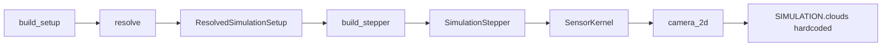

# s01 environment + reward (Simulation Setup API v2)

## Goal

Finish the s01 simulation environment and reward layer on top of [`EnvironmentSetup`](backend/simulation/setup_types.py) / [`EpisodeRunner`](backend/autonomous_control/episode_runner.py), per [user-manual Simulation Setup API](docs/user-manual.md). Deliver a **visible demo video** (notebook export) showing enlarged clouds + dual-camera strips. Mark anything that cannot be passed as setup objects (or needs new state machines) as **`TODO(s01-background)`** in code and a short registry in the notebook constraints cell.

## Scope (confirmed)

| In scope | Out of scope (TODO) |
|---|---|
| Plumb `resolved.clouds`, `target_areas`, `cameras`, `camera_kernel_backend` into stepper/kernels | RW safe mode 30/35/45°, torque taper, 10 s nadir lockout |
| Dual camera: second 1D observation line (~200 bins), agent obs, render strip | Fisheye distortion model |
| Larger static clouds via `build_setup(clouds=…)` | Cloud translation, time-varying height |
| Reward terms from existing signals (cloud fraction, visibility) | Discrete `capture_image` action, 10 images/orbit quota |
| **`controller_mode="coast"`** — always **0 N·m** torque | Motion-blur / ground-speed reward |
| **s01 initial attitude: exact nadir** via `OrbitConfig.sat_z_offset = 0°` | Safe-mode forced nadir hold (10 s lockout) |
| Notebook video + coast benchmark run | Full RL training pass for all new terms |

**Benchmark (user):** Two independent knobs for the s01 baseline:

1. **Coast controller** — policy always outputs `0` N·m (not a separate episode type).
2. **Nadir initialization (s01 only)** — `build_setup()` sets `OrbitConfig(sat_z_offset=0 * ureg.deg)` so the stepper starts at the canonical nadir body angle:

   `sat_z_initial = sat_theta_start + π + sat_z_offset` ([`stepper.py`](backend/simulation/stepper.py) L144) → with `sat_z_offset=0`, body +Z points at Earth center at orbit start.

   RL/warmup episodes use the same s01 default unless a test explicitly overrides `sat_z_offset`.

---

## Design decisions (plan review — locked)

### A. Boresight tilt in 2D (body frame → orbit disk)

| Body frame | 2D orbit disk |
|---|---|
| **+x** flight direction | Tangent to orbit circle, **prograde** (increasing `theta_orbit_rad`) |
| **+z** nadir | Radial inward; `boresight_nadir = [cos(body_z_angle_rad), sin(body_z_angle_rad)]` |
| **+y** cross-track | Out of disk (not modeled) |

**Tilt** is rotation about body **+y** → in-plane rotation of boresight in the x–z (orbit) plane:

```python
# camera_2d.py — reuse _rotate_unit_xy (L186)
boresight_for_mount = _rotate_unit_xy(boresight_nadir, tilt_signed_rad)
```

**Sign convention (locked before implementation):**

- **Positive `tilt_off_nadir`** → rotate boresight in the **prograde / forward-along-track** direction (ahead of subsatellite on the ground track).
- Verify with TDD: at `k=0`, secondary `camera_ground_center_xy_km` is displaced from primary in the same direction as `sat_pos[k+1] - sat_pos[k]` (ahead, not behind). Label render strip **“Forward (along-track)”**.

**s01 default:** `tilt_off_nadir=25 * ureg.deg` on the secondary mount — **not 0°**. At 0° both strips are redundant (same boresight); 25° gives along-track lookahead consistent with the notebook “forward-looking” intent.

**TDD:** `test_secondary_boresight_distinct_from_primary` — assert center ground points differ by > 1 km at nadir init for s01 mounts.

### B. Heterogeneous per-camera bin counts (`SimulationStateSeries`)

**Decision:** Per-camera bin count is **first-class** for the secondary observation line only in v2.

| Field | Shape | Notes |
|---|---|---|
| `camera_observation_line_codes` | `(n, n_primary)` | default 100 |
| `fixed_ground_line_codes` | `(n, n_primary)` | unchanged; **must** match primary bins only |
| `secondary_camera_observation_line_codes` | `(n, n_secondary)` | default 200 via `SimulationOverrides` |
| `secondary_fixed_ground_line_codes` | — | **Not in v2** (fixed bird view stays primary-only) |

**`__post_init__` audit** ([`state_types.py`](backend/simulation/state_types.py) L126):

- Keep: `fixed_ground_line_codes.shape[1] == camera_observation_line_codes.shape[1]`
- Add: independent validators for `secondary_camera_observation_line_codes` (2D, int8, axis-0 length `n`; **no** equality constraint vs primary)
- Document in dataclass docstring that bin dimensions may differ across camera fields

### C. Cloud array preallocation

Stepper must use **`len(resolved.clouds)`**, not `len(SIMULATION.clouds)`, when allocating `cloud_arc_*` arrays `(n, n_clouds)`.

**TDD:** `test_stepper_cloud_arc_shape_matches_setup` — `SIMULATION.clouds` has 1 entry, setup provides 2 → finalized series `cloud_arc_radius_km.shape[1] == 2`.

Pass `clouds=` through `compute_cloud_arc_specs_at_time` (add parameter; stop reading global inside kernel).

### D. `controller_mode="coast"`

Single allowlist in [`SIMULATION.py`](backend/environment_definition/constants/SIMULATION.py) or `stepper.py`:

```python
_BASELINE_CONTROLLER_MODES = frozenset({"baseline", "random", "coast"})
```

Reference from `_build_simulation_controller`, `run_baseline_rollout_from_stepper`, and **`run_baseline_rollout`** (legacy flat-kwargs path). Extend `Literal` on `SimulationConfig` to match.

### E. `SimulationTimestepState` (agent path)

`EpisodeRunner` builds obs from **`SimulationTimestepState`**, not the series. Must add:

- `secondary_camera_observation_line_codes: np.ndarray`
- Optional: `secondary_camera_cloud_blocked_fraction: float` (if secondary reward term enabled)

Populate in `SimulationStepper.current_timestep_state()` every step.

### F. Phase ordering (integration gate)

```text
1.1–1.2 plumbing → 1.3 optics/tilt → 2.1–2.2 series + stepper
     → test_dual_camera_series_shape + cloud shape test (GREEN)
     → 2.3 timestep + agent obs
     → 2.4 render secondary strip (blocked until shape test green)
     → Phase 3 reward TDD
     → Phase 4–5 benchmark + video
```

### G. `S01_CLOUDS` (fixed lat extents)

Target stripe ([`MISSION.py`](backend/environment_definition/constants/MISSION.py)): **89.65°–90.0° N**.

```python
S01_CLOUDS = (
    Cloud(height=15.0 * ureg.km, start_location=89.70 * ureg.deg, end_location=90.05 * ureg.deg),  # over target
    Cloud(height=12.0 * ureg.km, start_location=89.55 * ureg.deg, end_location=89.78 * ureg.deg),  # leading edge
)
```

Cloud 1 partially occludes the observation stripe → `camera_cloud_blocked_fraction` and cloud penalty can activate. Cloud 2 adds wider scene without fully replacing cloud 1.

### H. Cloud reward signal (single choice)

**Use `camera_cloud_blocked_fraction` only** (strip-level imaging quality). Do **not** use `camera_center_ray_observation_code` for the penalty term (edge disagreement near cloud boundaries).

Optional secondary term uses `secondary_camera_cloud_blocked_fraction` when the wide camera is evaluated.

### I. Minor placements

| Item | Decision |
|---|---|
| `secondary_camera_observation_line_n_bins` | [`SimulationOverrides`](backend/simulation/setup_types.py) — not on `CameraMount` (keeps optics types simulation-agnostic) |
| Coast benchmark helper | [`utils/notebook/benchmark.py`](backend/utils/notebook/benchmark.py) (new) or extend [`episode_log.py`](backend/utils/notebook/episode_log.py) — **not** mission profile |
| `require_camera` | New `EpisodeRunner(..., require_camera: bool = False)` kwarg; s01 notebook passes `True`; bus-only `include_cameras=False` unchanged |

### J. Secondary bins: resolve default vs. stepper allocation guard

`resolve()` may set `secondary_camera_observation_line_n_bins=200` when `len(cameras) >= 2`, but a **single-camera** setup can still carry a stray non-`None` override. The stepper must **not** trust the resolved number alone.

**Stepper rules (implementation):**

```python
has_secondary = len(self._cameras) >= 2
self._n_bins_secondary = (
    int(resolved_secondary_bins) if has_secondary else 0
)
# Only when has_secondary:
#   allocate secondary_camera_observation_line_codes (n, n_bins_secondary)
#   allocate secondary_camera_cloud_blocked_fraction (n,)
# In _populate_camera_and_reward: evaluate secondary only if has_secondary
```

When `has_secondary` is false:

- Do **not** preallocate secondary arrays (or set `self._n_bins_secondary = 0` and skip allocation entirely).
- `finalize_series()`: omit secondary fields **or** emit `(n, 0)` / `OBSERVATION_LINE_NOT_COMPUTED` fill — prefer **omitting optional fields** if series schema allows, else `(n, 1)` filled with `-99` only if downstream requires a fixed schema; document choice in `state_types` (v2: include fields always but shape `(n, 0)` is invalid — use `Optional` absent from series or sentinel 1-bin not-computed row).

**Locked choice for v2:** Always include `secondary_camera_observation_line_codes` on `SimulationStateSeries` with shape `(n, n_bins_secondary)` where `n_bins_secondary == 0` means “no secondary camera” and `__post_init__` skips secondary validation when `shape[1] == 0`. Timestep carries `secondary_camera_observation_line_codes` as empty `np.array([], dtype=int8)` or shape `(0,)`.

**TDD:** `test_single_camera_ignores_secondary_bin_override` — one mount, override `secondary_camera_observation_line_n_bins=200` → series secondary shape `(n, 0)` or field absent per locked choice; stepper must not call secondary `SensorKernel` path.

**`resolve()` hygiene:** When `len(cameras) < 2`, force `secondary_camera_observation_line_n_bins` to `0` (or `None` → 0) in `ResolvedSimulationSetup` so factory/stepper never see a misleading 200.

---

## Current gap (why setup objects are ignored)



[`build_stepper`](backend/simulation/stepper_factory.py) does not pass `cameras`, `clouds`, `target_areas`, or `camera_kernel_backend`. [`compute_cloud_arc_specs_at_time`](backend/simulation/camera_2d.py) reads `SIMULATION.clouds` directly. [`RewardKernel`](backend/simulation/reward_kernel.py) hard-codes `picture_taken=True` and `OBSERVATION_TARGET_AREAS[0]`.

---

## Phase 1 — Setup plumbing (config objects → runtime)

### 1.1 Extend setup types (minimal)

In [`setup_types.py`](backend/simulation/setup_types.py):

- `SimulationOverrides.secondary_camera_observation_line_n_bins: int | None = None` → resolve sets **200** only when `len(cameras) >= 2`; otherwise **0** (§J — never leave 200 on a single-camera resolved setup).
- `S01_CLOUDS` in [`s01_multiple_targets_fwd_fish.py`](backend/environment_definition/mission_profiles/s01_multiple_targets_fwd_fish.py) — see **§G** for exact lat extents.

Update [`build_setup()`](backend/environment_definition/mission_profiles/s01_multiple_targets_fwd_fish.py):

- `orbit=OrbitConfig(altitude=sampled, sat_z_offset=0 * ureg.deg)` — explicit nadir init.
- `clouds=S01_CLOUDS`
- Dual mounts: nadir `tilt_off_nadir=0°`; secondary 70° FOV, **`tilt_off_nadir=25 * ureg.deg`** (forward along-track, §A).
- `SimulationOverrides(secondary_camera_observation_line_n_bins=200, reward_config=…)` for phase 3.

### 1.2 Thread resolved fields through factory → stepper

[`stepper_factory.build_stepper`](backend/simulation/stepper_factory.py) → pass:

- `clouds`, `target_areas`, `cameras`, `camera_kernel_backend`
- Per-camera bin counts (primary = `resolved.camera_observation_line_n_bins`, secondary = override)

[`SimulationStepper`](backend/simulation/stepper.py):

- Store `self._clouds`, `self._target_areas`, `self._cameras`
- **Secondary guard (§J):** `has_secondary = len(self._cameras) >= 2`; `self._n_bins_secondary = resolved_secondary_bins if has_secondary else 0`; allocate/populate secondary arrays **only if `has_secondary`**
- Preallocate `cloud_arc_*` with **`n_clouds = len(self._clouds)`** (§C)
- Pass `clouds=` into `compute_cloud_arc_specs_at_time` and `SensorKernel`
- Use `resolved.target_areas[0]` in area overlap + reward kernel

### 1.3 Per-mount optics + boresight (§A)

- `vertical_fov_rad` argument on strip/line simulators from `CameraImage.fov(axis="y")`.
- `boresight_dir_for_mount(body_z_angle_rad, tilt_off_nadir_rad)` in `camera_2d.py` — wraps `_rotate_unit_xy`; **+tilt = prograde**.
- `SensorKernel.evaluate`: `clouds`, `vertical_fov_rad`, `boresight_dir_unit_xy`, `kernel_backend`.

**TDD (phase 1 exit):**

- [`test_simulation_setup.py`](backend/tests/test_simulation_setup.py) — resolved clouds override global
- `test_stepper_cloud_arc_shape_matches_setup` — 2-cloud setup vs 1 global (§C)
- `test_secondary_boresight_distinct_from_primary` — 25° tilt → different ground centers (§A)
- [`test_camera_observation_line_1d.py`](backend/tests/test_camera_observation_line_1d.py) — non-default FOV

---

## Phase 2 — Dual camera artifact + agent + render

### 2.1 Canonical series fields (§B)

Extend [`SimulationStateSeries`](backend/simulation/state_types.py):

- `secondary_camera_observation_line_codes: np.ndarray` — `(n, n_secondary)` e.g. 200
- `secondary_camera_cloud_blocked_fraction: np.ndarray` — per-frame scalar (for optional secondary reward)
- Audit `__post_init__` per §B; **no** `secondary_fixed_ground_line_codes` in v2

Extend [`SimulationTimestepState`](backend/simulation/state_types.py) with the same secondary fields (§E) — required for `EpisodeRunner` / `build_state_vector_from_timestep`.

### 2.2 Stepper loop

In `_populate_camera_and_reward`:

- Primary mount → existing arrays (`n_primary` bins)
- If `len(cameras) >= 2`: secondary evaluate with `n_secondary` bins + tilted boresight

`EpisodeRunner.__init__(setup, *, require_camera: bool = False)` — s01 notebook: `require_camera=True`; bus-only stays `False` (§I).

### 2.3 Agent observation (after shape tests green)

[`ControllerFeatureConfig`](backend/autonomous_control/feature_selection.py): `secondary_camera_observation_line_codes` in `vision_keys`.

Update [`controller_observation_dim`](backend/autonomous_control/training_runtime.py) (+200 one-hot bins).

Populate via `current_timestep_state()` — not read back from series during the loop.

**Gate:** `test_dual_camera_series_shape` + timestep field present at `k=0`.

### 2.4 Render (view-only) — gated (§F)

**Only after** `test_dual_camera_series_shape` is green.

Reuse [`build_1d_sat_view`](backend/render/_satellite_cam_view.py) with `n_bins=N_BINS_SECONDARY` from series shape.

- Panel `SHOW_1D_SECONDARY_SAT_VIEW`; label **“Forward (along-track)”**
- Render reads `secondary_camera_observation_line_codes[sim_idx]` only — no simulation

---

## Phase 3 — Reward function (existing signals)

Extend [`RewardConfig`](backend/autonomous_control/reward.py):

| Term | Signal | Behavior |
|---|---|---|
| `enable_cloud_penalty` | **`camera_cloud_blocked_fraction` only** (§H) | Scale down / gate distance term when strip blocked |
| `enable_secondary_cloud_penalty` | `secondary_camera_cloud_blocked_fraction` | Optional wide-FOV term |
| Keep distance / area / energy | unchanged | Enable area novelty optionally in s01 overrides |

[`RewardKernel.evaluate`](backend/simulation/reward_kernel.py):

- Pass `target_area` from `resolved.target_areas`
- Pass cloud fractions from stepper
- `picture_taken`: remain `False` until capture mode exists → add `# TODO(s01-background): wire from capture state machine`

Wire s01 default in `build_setup` via `SimulationOverrides(reward_config=RewardConfig(...))`.

**TDD:** [`test_area_target_reward.py`](backend/tests/test_area_target_reward.py)-style cases for cloud penalty; fix stale [`test_reward_v1.py`](backend/tests/test_reward_v1.py) if touched.

---

## Phase 4 — s01 nadir init + zero-torque coast benchmark

### 4.0 s01 nadir initial attitude (setup object)

Nadir init is **config-only** — already supported by `OrbitConfig.sat_z_offset` → `ResolvedSimulationSetup.sat_z_offset_deg` → stepper init.

- [`build_setup()`](backend/environment_definition/mission_profiles/s01_multiple_targets_fwd_fish.py): always pass `sat_z_offset=0 * ureg.deg`.
- **Verification test** (TDD): after `build_stepper` + first `_populate_camera_and_reward` at `k=0`:
  - Primary mount boresight ray hits Earth (not space): `camera_center_ray_observation_code == OBSERVATION_EARTH` or target.
  - Optional: `los_rel_nadir_deg` ≈ 0° at t=0 (if exposed in series/telemetry).

Document in [`docs/user-manual.md`](docs/user-manual.md): *“s01 missions set `sat_z_offset=0` for nadir-pointing initial attitude.”*

### 4.1 `controller_mode="coast"`

Add `_BASELINE_CONTROLLER_MODES` and extend `SimulationConfig.controller_mode` literal to include `"coast"` (§D).

In [`stepper._build_simulation_controller`](backend/simulation/stepper.py):

```python
if mode == "coast":
    return ZeroTorquePolicy(adapter_env)  # always np.array([0.0])
```

New tiny policy in [`controller_baselines.py`](backend/autonomous_control/controller_baselines.py) (or inline closure): `get_action` → zero torque always.

Update guards in `run_baseline_rollout_from_stepper` **and** `run_baseline_rollout` to use `_BASELINE_CONTROLLER_MODES` (§D).

### 4.2 Benchmark helper (notebook)

Add `run_s01_coast_benchmark(setup, seed)` in [`utils/notebook/benchmark.py`](backend/utils/notebook/benchmark.py) (preferred) or [`episode_log.py`](backend/utils/notebook/episode_log.py) — **not** mission profile (§I):

- `setup = build_setup(seed=…, include_cameras=True)` — includes **nadir init** (`sat_z_offset=0`) and s01 clouds/cameras
- `run_simulation(setup, SimulationConfig(controller_mode="coast", render_mode=HEADLESS))`
- Log per-episode KPIs: mean reward, mean cloud blocked %, target visibility rate, initial-frame nadir check, optional CSV row

Coast fixes torque; nadir init fixes starting attitude — both are active in the default s01 benchmark.

---

## Phase 5 — Demo video (acceptance)

In [`s01_run.ipynb`](backend/notebooks/experiments/s01_run.ipynb):

1. Cell: `setup = build_setup(seed=7)` with new clouds + cameras
2. `series = run_simulation(setup, SimulationConfig(controller_mode="coast", render_mode=HEADLESS))` (or short random warmup if coast is too static visually—prefer **coast** for benchmark, **random** optional for dramatic clouds in video if needed; document choice in cell)
3. `_export_render_video(simulation_series=series, out_path=…)` → play in notebook

User should see: larger clouds in main view, **two** 1D strips (nadir + wide).

---

## TODO registry (cannot be setup objects yet)

Add a single module or notebook section **`TODO(s01-background)`** listing:

| Item | Why not setup-only | Target layer |
|---|---|---|
| RW 30/35/45° safe mode + torque taper | State machine + attitude limits | `reaction_wheel.py` / stepper pre-step |
| Safe mode 10 s nadir hold | Controller gating | stepper + controller adapter |
| Cloud motion / height variation | Time-varying `Cloud` model | `camera_2d.compute_cloud_arc_specs_at_time` |
| `capture_image` action + 2 s ground-speed window | Discrete event + action space | `episode_runner`, `action_adapter`, stepper |
| Max 10 images / orbit | Episode counter + termination | stepper / mission constraints type |
| Motion-blur reward | Needs capture interval + velocity model | simulation + reward |
| `picture_taken` truth | Tied to capture mode | reward_kernel |
| Fisheye projection | New ray model | `camera_2d` |

Document in [`docs/user-manual.md`](docs/user-manual.md) under Simulation Setup API: which fields are **wired** vs **declared-only**.

---

## Files touched (expected)

- [`backend/simulation/setup_types.py`](backend/simulation/setup_types.py), [`stepper_factory.py`](backend/simulation/stepper_factory.py), [`stepper.py`](backend/simulation/stepper.py)
- [`backend/simulation/sensor_kernel.py`](backend/simulation/sensor_kernel.py), [`camera_2d.py`](backend/simulation/camera_2d.py), [`state_types.py`](backend/simulation/state_types.py)
- [`backend/simulation/reward_kernel.py`](backend/simulation/reward_kernel.py), [`autonomous_control/reward.py`](backend/autonomous_control/reward.py)
- [`backend/environment_definition/mission_profiles/s01_multiple_targets_fwd_fish.py`](backend/environment_definition/mission_profiles/s01_multiple_targets_fwd_fish.py)
- [`backend/environment_definition/constants/SIMULATION.py`](backend/environment_definition/constants/SIMULATION.py) (`controller_mode` coast)
- [`backend/autonomous_control/controller_baselines.py`](backend/autonomous_control/controller_baselines.py), [`feature_selection.py`](backend/autonomous_control/feature_selection.py), [`training_runtime.py`](backend/autonomous_control/training_runtime.py)
- [`backend/render/render_main.py`](backend/render/render_main.py), [`_satellite_cam_view.py`](backend/render/_satellite_cam_view.py)
- [`backend/notebooks/experiments/s01_run.ipynb`](backend/notebooks/experiments/s01_run.ipynb), [`docs/user-manual.md`](docs/user-manual.md)
- Tests: `test_simulation_setup.py`, `test_dual_camera_series_shape`, `test_stepper_cloud_arc_shape_matches_setup`, `test_secondary_boresight_distinct_from_primary`, coast tests
- New: [`utils/notebook/benchmark.py`](backend/utils/notebook/benchmark.py)

Presentation docs (cloud sizes, reward weights): update [`docs/presentation/environment-hyperparameters.md`](docs/presentation/environment-hyperparameters.md) and [`machine-learning.md`](docs/presentation/machine-learning.md) when numeric values are finalized.
