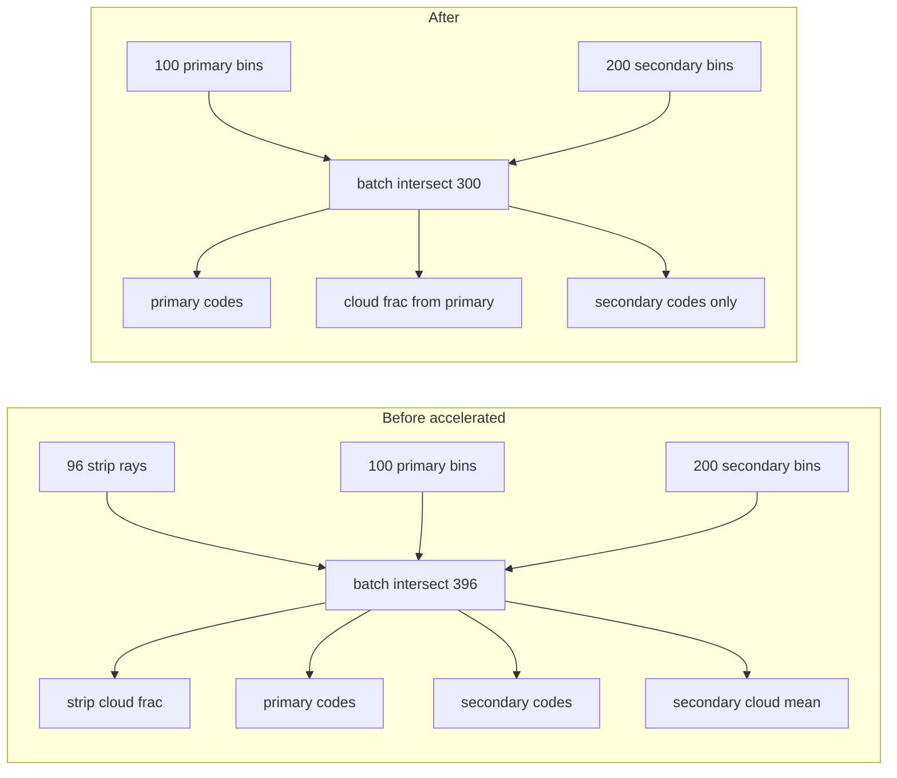

# Merge primary camera rays into single 100-bin pass

## Goal

Replace the dual primary-camera ray grids (96 strip + 100 bins) with **one** `_line_bin_ray_dirs` pass (`n_bins=100`). Derive `camera_cloud_blocked_fraction` from those same hits. Secondary camera traces **only** its 200-bin observation line — no `secondary_camera_cloud_blocked_fraction` computation (store `0.0`).

**Non-goals:** Rewriting `camera_2d.simulate_camera_strip_2d` / `simulate_camera_observation_line_1d` (keep as low-level test/benchmark APIs). GPU/CUDA work.

## Current vs target (per timestep, dual-camera training)



Footprint geometry (left/center/right ground points, GSD, center-ray code) stays as **3 cheap edge/boresight intersections** — unchanged.

**Expected ray reduction:** 396 → 300 batched rays (~24% fewer in `sensor_camera_rays`). Must not regress `steps_per_s` (hard gate via `sim_timing`).

## Core code change

**Primary file:** [`backend/simulation/sensor_kernel.py`](backend/simulation/sensor_kernel.py)

1. **Add helper** `_cloud_blocked_fraction_from_hit_types(hit_types, sat_pos_xy_km, ray_dirs)` — reuse existing strip logic (valid earth intersection + first hit cloud) but on primary bin rays:

```python
t_earth = _batch_earth_hit_distances_km(sat_pos_xy_km, ray_dirs)
valid_mask = np.isfinite(t_earth)
blocked = (hit_types == 2) & valid_mask
return 0.0 if valid == 0 else count(blocked) / valid
```

2. **Refactor `_evaluate_fused_accelerated`** (rename → `_evaluate_sensors`):
   - Remove `_strip_pixel_ray_dirs` and `strip_dirs` from ray batch.
   - `ray_parts = [primary_dirs]` + optional `secondary_dirs`.
   - `primary_codes = _classify_line_from_hits(...)`.
   - `cloud_blocked_fraction = _cloud_blocked_fraction_from_hit_types(primary_types, ...)`.
   - **Drop** `scnd_cloud_fraction = mean(scnd_codes == CLOUD)` — always `secondary_camera_cloud_blocked_fraction=0.0`.

3. **Remove `_evaluate_legacy` double-call path** — route **both** `python` and `accelerated` backends through the same fused evaluator (batch helpers already exist in `camera_2d.py`). Delete dependency on `simulate_camera_strip_2d` inside `sensor_kernel.py`.

4. **Remove `camera_pixel_ray_samples` from `SensorKernel.evaluate` signature** and all call sites.

## Plumbing cleanup

| Area | Action |
|------|--------|
| [`backend/simulation/stepper.py`](backend/simulation/stepper.py) | Drop `_camera_pixel_ray_samples`, constructor arg, and pass-through to `SensorKernel` |
| [`backend/simulation/stepper_factory.py`](backend/simulation/stepper_factory.py) | Stop reading `resolved.camera_pixel_ray_samples` |
| [`backend/simulation/setup_types.py`](backend/simulation/setup_types.py) | Remove `camera_pixel_ray_samples` from `SimulationOverrides` / `ResolvedSimulationSetup` (or keep override as deprecated no-op with one release comment — prefer **remove** + fix call sites) |
| [`backend/environment_definition/constants/SIMULATION.py`](backend/environment_definition/constants/SIMULATION.py) | Remove `camera_pixel_ray_samples` field; document that cloud stats come from observation bins |
| [`backend/simulation/run_simulation.py`](backend/simulation/run_simulation.py) | Remove param |
| [`backend/simulation/simulation_info.py`](backend/simulation/simulation_info.py) | Remove “strip ray samples” row; relabel cloud penalty text from “primary strip” → “primary observation line” |
| Notebook helpers | [`movement_constraints_patch.py`](backend/notebooks/s01/s01_utils/movement_constraints_patch.py), [`image_quality_verification.py`](backend/notebooks/s01/s01_utils/image_quality_verification.py) — drop `camera_pixel_ray_samples` overrides (use `camera_observation_line_n_bins` if needed) |
| Warmup cache | Bump [`NB_WARMUP_BUNDLE_VERSION`](backend/autonomous_control/notebook_warmup_bundle_cache.py) (user accepted behavior shift) |

**Secondary cloud fraction:** Keep array fields on [`SimulationStateSeries`](backend/simulation/state_types.py) / stepper buffers for schema stability; fill with `0.0`. Reward already uses it only when `enable_secondary_cloud_penalty=True` (default **False** in [`reward.py`](backend/autonomous_control/reward.py)).

## Tests (implementation-discipline slices)

1. **Unit — merged kernel behavior** (`backend/tests/test_sensor_kernel_merged_rays.py` or extend existing):
   - Primary line codes shape `(100,)`, secondary `(200,)` on dual-camera fixture.
   - `cloud_blocked_fraction in [0,1]` and finite when footprint valid.
   - `secondary_camera_cloud_blocked_fraction == 0.0` always (current training config).

2. **Unit — cloud fraction formula** on synthetic hit_types (no full sim): blocked fraction matches helper definition.

3. **Update** [`test_simulation_setup.py`](backend/tests/test_simulation_setup.py): remove pixel-ray-sample resolve tests; keep `camera_observation_line_n_bins` tests.

4. **Update** [`test_dual_camera_simulation.py`](backend/tests/test_dual_camera_simulation.py): secondary cloud array exists but is all zeros.

5. **Regression suite:** `pytest backend/tests/test_mpo_capture_wiring.py backend/tests/test_dual_camera_simulation.py backend/tests/test_episode_runner.py` (targeted, not full suite).

6. **Do not** require bit-identical `cloud_blocked_fraction` vs old 96-ray strip — document expected small shift in test docstring.

Low-level [`test_camera_kernel_backend_parity.py`](backend/tests/test_camera_kernel_backend_parity.py) and [`test_camera_optics_2d.py`](backend/tests/test_camera_optics_2d.py) keep testing `simulate_camera_strip_2d` in isolation — unchanged.

## Performance gate (mandatory, before merge)

Per [`performance-optimization` skill](.cursor/skills/performance-optimization/SKILL.md):

```powershell
conda activate auto-sat
python backend/scripts/experiments/sim_timing/run_profile.py --scenario high_cloud
```

**Before** implementing: capture baseline `steps_per_s` and `sensor_camera_rays` `total_s` / `pct_of_sim_loop`.

**After** implementing: re-run same command.

**Pass criteria:**
- `steps_per_s` ≥ baseline (strict: not slower).
- `sensor_camera_rays.total_s` ≤ baseline (expect decrease; if flat, still OK if overall steps/s improved or unchanged).

If `environment_clouds` dominates (~77%), overall gain may be modest — ray-bin reduction must still not increase `sensor_camera_rays`.

Optional quick micro-benchmark: [`backend/scripts/benchmark_sensor_kernels.py`](backend/scripts/benchmark_sensor_kernels.py) updated to time fused `SensorKernel.evaluate` only.

## Documentation

Update [`docs/presentation/technical-constants.md`](docs/presentation/technical-constants.md) (and one bullet in [`environment-hyperparameters.md`](docs/presentation/environment-hyperparameters.md) if camera obs is documented there):
- Single primary vertical discretization: `camera_observation_line_n_bins = 100`.
- `camera_cloud_blocked_fraction` derived from those bins (not a separate pixel subsample).
- Secondary camera: observation line only; no secondary cloud-fraction stat in production.

## Rollout order

1. Baseline `sim_timing` snapshot (save JSON path in PR notes).
2. Implement fused sensor path + plumbing removal in one focused PR slice.
3. Tests green.
4. Post-change `sim_timing` + compare.
5. Bump warmup bundle version; user rebuilds warmup cache on next notebook run.

## Risk notes

- **Reward signal drift:** small change to capture/cloud shaping; accepted — retrain/eval comparisons vs old checkpoints are not apples-to-apples.
- **Experiment scripts** under `scripts/experiments/sensor_ray_batch/` still reference strip+line separately for historical parity — update README to note production path merged; adjust `_runner_common.py` parity checks only if still used for CI (otherwise leave as historical benchmark, out of critical path).
