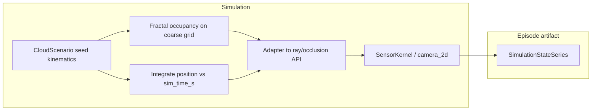

# Moving clouds + observation-gated score + main/secondary cameras + 2D damage (3D deferred)

## Current baseline (what exists today)

- **Camera / geometry:** **Orbit-plane 2D** ([`camera_2d.py`](backend/simulation/camera_2d.py)), single effective imaging axis today (`body_z_angle_rad`). **No secondary wide-FOV channel yet.** **Main-only** log damage not implemented. **Full 3D LOS** deferred (see Deferred).
- **Clouds:** Defined as static latitude extents on `LON_GLOBAL` in [`SIMULATION.clouds`](backend/environment_definition/constants/SIMULATION.py); [`compute_cloud_arc_specs_at_time`](backend/simulation/camera_2d.py) maps them to opaque **arc segments** on circles at `earth_radius_km + height`, with time-only **growth** scaling from [`RENDER.cloud_growth_max_span_scale`](backend/environment_definition/constants/RENDER.py). [`SensorKernel`](backend/simulation/sensor_kernel.py) feeds those specs into [`simulate_camera_observation_line_1d`](backend/simulation/camera_2d.py) / strip simulation.
- **Rendering:** [`render_main._cloud_world_xy_for_frame`](backend/render/render_main.py) plots arcs from `SimulationStateSeries.cloud_arc_*` only — consistent with **render-is-view-only**.
- **Target coverage:** [`SimulationStepper._populate_camera_and_reward`](backend/simulation/stepper.py) uses [`circle_stripe_footprint_overlap_ratio`](backend/utils/geodesics/geodesic_helpers.py) for `target_area_intersection_ratio`. Novelty uses a **placeholder** cell. **No** min-observation dwell gate, **no** explicit stillness term in reward yet — Feature B replaces this trajectory.

## Design principles (aligned with repo rules)

- **Single simulation source of truth:** Cloud motion, fractal shape draws, and cell bookkeeping live under [`backend/simulation/`](backend/simulation/) (and constants under [`environment_definition/constants/`](backend/environment_definition/constants/)). No parallel cloud simulation in [`backend/render/`](backend/render/).
- **Units:** All physical quantities (speed, heights, cell sizes, bearings) flow through **pint** via [`UNIT_REGISTRY`](backend/environment_definition/constants/UNIT_REGISTRY.py).
- **Artifact contract:** Extend [`SimulationStateSeries`](backend/simulation/state_types.py) (and stepper population) so train/eval/render share the same outputs — avoid ad-hoc parallel state types.
- **Naming:** Use stable terms **main_camera** (mission imaging, co-aligned with satellite attitude / damage axis) and **secondary_wide_fov** (cloud / forward context); document in ubiquitous-language / MISSION or SIMULATION constants as appropriate.

### Refactor-risk stance (agreed direction)

- **Greenfield OK** on this branch: may **reshape** APIs and obs content where it reduces duplication, **provided** we keep the **same overall artifact pattern** (episode = one `SimulationStateSeries`, stepper-owned physics, render view-only).
- **Reuse first:** Prefer extending [`SensorKernel`](backend/simulation/sensor_kernel.py), [`SimulationStepper`](backend/simulation/stepper.py), and existing reward entry points over parallel pipelines; **simplify** interfaces when one clear abstraction replaces two (document in PR).
- **Explicit breakage:** Notebooks, saved policies, and tests that assumed old scalar semantics may need updates — call out in changelog / migration notes; avoid silent numeric redefinition without updating [`docs/presentation/machine-learning.md`](docs/presentation/machine-learning.md) reward section.

## Feature A — Moving clouds + fractal + “≥1 km” primitives

**Semantics (from your answers):** Fixed horizontal **velocity** and **bearing** per scenario; **fixed seed** drives a **fractal / procedural** occupancy; cloud vertical extent constrained between **1 km and 20 km** MSL/agl-style height band (exact reference surface documented with constants). Clarify in code/docs one interpretation of “largest altitude change … per km” as a **maximum vertical gradient** (e.g. Δheight per horizontal ground km) so fractal thickness does not create unrealistic cliffs — store as a named constant with pint.

**Architecture:**

After **Feature D**, the same diagram logically gains a **secondary** ray bundle from `SensorKernel` into `SSS` (second observation line / strip pass).

- **Coarse world grid (≥1 km):** Generate/update occupancy on a **lon/lat (and height layer)** grid with cell spacing chosen so **ground footprint is at least ~1 km** at the mission latitude (constants in `environment_definition/constants`, not inferred by scraping). This addresses “not single pixels” in **world space**; display still maps those primitives to screen coordinates without implying sub-pixel physics.
- **Fractal generator:** New small module (e.g. `backend/simulation/clouds/fractal_field.py`) with a stable API: inputs = seed + bbox + resolution + parameters; output = boolean or float occupancy on the coarse grid. Keep it **simulation-side**; renderer only draws geometry derived from series fields.
- **Kinematics:** Integrate cloud reference position in **ground/wind frame** (velocity vector or speed + bearing) as a function of `sim_time_s`; expose time-varying geometry to occlusion.
- **Ray intersection strategy (incremental):**
  - **Phase 1 (minimal integration risk):** Convert each timestep’s coarse footprint into **one or more arc intervals** compatible with [`_first_hit_point_ray_earth_or_clouds`](backend/simulation/camera_2d.py) (multiple arcs per physical cloud), or generalize to a **sorted list of angular intervals** per altitude shell if needed.
  - **Phase 2 (if arcs are insufficient):** Extend the 2D ray test to clip against **piecewise angular masks** derived from the grid (still no rendering-side physics).

**Uncertainty modelling (“basic”):** Treat as **scenario uncertainty**: different seeds → different fractal realizations and/or sampled kinematics parameters drawn once per episode from documented distributions (constants), **not** a second parallel simulator. If you later need multi-hypothesis policies, add explicit series fields — avoid hiding stochasticity inside the renderer.

**Series fields:** Extend `SimulationStateSeries` with whatever is needed for **parity between train and viz**, e.g. per-cloud kinematic state summaries, arc specs (possibly variable count — see below), and optional compact encoding of fractal parameters for reproducibility.

**Variable cloud count / multiple arcs:** If fractals split into several intervals, prefer storing **`(n_frames, max_arcs)`** arrays with a valid mask or padding, or RLE — pick one pattern and validate in `__post_init__` like existing fixed `(n_frames, n_clouds)` cloud arrays.

## Feature B — Strip discretization + **minimal observation time** + **score** (area + stillness)

**Problem split:** (1) **Represent** how much of the mission strip has been **covered** (implementation: same **1D strip cells** as before — φ or latitude along [`ObservationTargetArea`](backend/environment_definition/constants/MISSION.py), aligned with [`primary_stripe_disk_phi_bounds_deg`](backend/utils/geometry/mission_stripe_disk.py)). (2) **Gate** when a “picture” / point is allowed: require a **minimum contiguous observation time** (pint `ureg.s`) where conditions for a valid observation hold (e.g. main footprint overlapping strip above a threshold **and** target visible per existing codes — exact predicate TBD + tested). (3) **Score** that episode step (or shutter event) from **area component** + **stillness component** while the camera is “taking the picture” during that window.

**Area component:** Derive from strip cells (e.g. fraction of strip cells cumulatively covered in the episode, or incremental new coverage in the window — pick one and document; avoid double-counting across frames).

**Stillness component:** While the observation window counts toward **min observation time**, measure **how still** the **main** pointing is — e.g. max or RMS **|dθ_main/dt|** below a pint threshold, or inverse of integrated jitter; expose scalar(s) on `SimulationStateSeries` for debugging and reward.

**Reward integration:** Extend or map into [`RewardSignals`](backend/autonomous_control/reward.py) / [`RewardConfig`](backend/autonomous_control/reward.py) / [`compute_reward`](backend/autonomous_control/reward.py) so **`picture_taken`** and any new **score** align (today `picture_taken` is always `True` from [`RewardKernel`](backend/simulation/reward_kernel.py) — reconcile so the gate is not lying). Prefer **additive new fields** on `RewardSignals` if the combiner needs explicit area_score + stillness_score; otherwise document a single **composite** with decomposition in series only.

**Legacy scalars:** `target_area_intersection_ratio` / `target_area_novelty_ratio` may become **derived** from strip state or superseded by named fields — OK under greenfield stance; update all in-repo callers in the same change set.

**Storage:** Strip visit state in stepper; per-frame scalars (timer, coverage fraction, stillness, optional episode cumulative) on `SimulationStateSeries`.

**Scope:** Phase 1 = **primary strip only**; multi-area later if needed.

## Feature C — **Main camera** off-nadir: 30° envelope, **logarithmic damage**, dwell anchors (**2D first**, no 3D LOS)

**Camera roles:** The **structural / off-nadir limits** (30° envelope, log `T_fail(θ)`, cumulative damage to failure) apply to **satellite pointing that co-aligns the main camera** — i.e. **main boresight vs nadir** in the 2D model. **Feature B** (area, observation dwell, stillness) uses the **main** footprint and main attitude rates unless you later add secondary-based scoring.

**Deferral:** **Do not** implement full **3D** boresight / ECEF ray pipeline in this phase. Revisit as a follow-on once strip + damage rules are stable.

**Off-nadir angle in 2D (main only):** Define **θ_main** from the **existing** state so it equals the angle between **main boresight** and **nadir** in the orbit-disk construction (consistent with [`body_z_angle_rad`](backend/simulation/state_types.py) and [`camera_2d`](backend/simulation/camera_2d.py) after any refactors that split “body” vs “main camera”). Document the exact formula in slides + code.

**30° — max movement envelope:** Same policy options as before (soft envelope + damage vs hard command clamp); **damage accrues only when θ_main > 30°** (boundary rule TBD + tested).

**Logarithmic damage model (calibrated):** Anchors (pint-backed; **“5m” = 5 minutes**):

| Sustained θ_main | Time to d = 1 (constant angle) |
|------------------|--------------------------------|
| **40°** | **5 min** |
| **50°** | **1 min** |

Fit **`log(T_fail)`** affine in **θ_main** on **[40°, 50°]**; extrapolate outside with documented clamps; per step **`d += Δt / T_fail(θ_main)`** when **θ_main > 30°**; **episode `done`** when **`d ≥ 1`**. Hysteresis (healing): default **none** unless specified.

**Simulation ownership:** Integrate in [`SimulationStepper`](backend/simulation/stepper.py); expose **`main_off_nadir_deg`**, **`structural_damage_0_1`**, termination flags in `SimulationStateSeries`; no damage math in render.

**Render path:** **View-only** overlays for **main** damage and angle from series fields.

## Feature D — **Secondary** wide-FOV camera (clouds / forward), fixed tilt from main

**Purpose:** A second sensor for **cloud analysis** and **looking forward** (along-track / ahead context in-world). It is **not** the axis used for **structural damage** (Feature C).

**Optics (your spec, pint-backed in constants + [`docs/presentation/technical-constants.md`](docs/presentation/technical-constants.md)):**

- **Full field of view:** **20°** (define whether half-angle or full cone width in code; default **full** = 20° total opening unless optics convention says otherwise — document).
- **Mounting:** Boresight is **fixed relative to the main camera / bus**: when the bus is in **nadir** attitude, **main** looks **straight to ground**; **secondary** boresight is **20°** from main in the **“forward / upward”** direction (ahead of nadir in the mission plane).

**2D implementation (this phase):** Model **secondary boresight direction** = **rotate main boresight by +20°** in the **orbit-plane 2D** using a documented convention (e.g. positive rotation = **toward velocity / forward** on the disk). “Upward” out of the orbital plane is **deferred** with 3D LOS; document the 2D proxy so future 3D does not silently change behavior.

**Simulation outputs:** Reuse the same ray–Earth / cloud classification machinery as the main line/strip (e.g. second call with **secondary** center ray + **20°** fan → per-bin codes, center hit, **cloud_blocked_fraction**, etc.). Add parallel arrays (or a small nested struct) on **`SimulationStateSeries`** with a **`secondary_`** prefix (names TBD but stable). **SensorKernel** / stepper owns both passes; render only draws precomputed secondary footprints / hits.

**Bins / resolution:** Choose `n_bins_secondary` (constant) suitable for RL obs size; can differ from main `camera_observation_line_n_bins`.

**Rewards / policy:** Default: **secondary** feeds **observation** only unless you explicitly add reward terms later — document non-goals in the plan at implementation time.

## Deferred — Full 3D side-looking

- **3D LOS:** ECEF positions, full boresight cone off true local nadir, 3D cloud volumes, and footprint polygons in geodetic — **not** in this implementation pass.
- **When to pick up:** After strip cell metrics and 2D damage rules have tests and stable constants; then replace the 2D off-nadir definition with the 3D one in one migration PR to avoid double semantics.

## Documentation and tests

- Update slideshow constants: [`docs/presentation/environment-hyperparameters.md`](docs/presentation/environment-hyperparameters.md) (strip cells, **min observation time**, stillness thresholds, score composition, clouds, **main** damage, **secondary FOV 20° + tilt 20°**), [`docs/presentation/machine-learning.md`](docs/presentation/machine-learning.md) (reward / `RewardSignals` changes), and [`docs/presentation/technical-constants.md`](docs/presentation/technical-constants.md) for secondary optics.
- **TDD slices:** (1) strip cell indexing + coverage accounting; (2) **min observation time** — no point/score until contiguous valid dwell reached; (3) **stillness** — high jitter fails stillness component (fixture with synthetic ω or Δθ); (4) cloud kinematics + arc adapter; (5) **main** damage anchors **40°/5 min**, **50°/1 min**; (6) **secondary** geometry smoke test.

## Risk note

Moving from pure analytic arcs to **fractal grids** touches hot paths in [`camera_2d.py`](backend/simulation/camera_2d.py) and [`sensor_kernel.py`](backend/simulation/sensor_kernel.py). Keep Phase 1 adapter **thin** and profile `camera_kernel_backend` paths to avoid blowing up episode generation time.

**2D semantics:** **Main** off-nadir and **secondary** “forward/up” tilt are both **in-plane** until 3D LOS exists—document so docs do not over-claim out-of-plane upward look. **Secondary** does not affect structural damage.
