# Minimal Feature Cycle

Run a backlog item through five phases. The notebook is a thin scratchpad over real production modules; validation lives where it belongs; root causes are fixed at the source.

## Phase 1 — Scope from backlog

1. Read the backlog entry (typically [.cursor/plans/backlog-hot-now.md](../../plans/backlog-hot-now.md) or a ticket the user names).
2. Copy [.cursor/plans/00-initialized/DEFAULT_DEVELOPMENT_CYCLE.plan.md](../../plans/00-initialized/DEFAULT_DEVELOPMENT_CYCLE.plan.md) to a new file in `00-initialized/`. Rename with a short suffix.
3. Fill section 0: problem, outcome, non-goals, backward compatibility, acceptance criteria.
4. When scope is fuzzy, ask the questions required by [.cursor/rules/planning-clarifying-questions.mdc](../../rules/planning-clarifying-questions.mdc) before writing code.

## Phase 2 — Build the minimal feature notebook

1. Copy `templates/notebook_template.ipynb` to `backend/notebooks/minimal_feature_cycle/<feature_name>.ipynb`.
2. The notebook imports the production module and calls `importlib.reload(...)` after each edit. No helper logic lives in the notebook.
3. If a helper is reused across cells, promote it to a production module first, then import it. Do not let parallel logic emerge in the notebook.
4. Use the minimal verifying snippet to exercise the changed function with the smallest meaningful inputs.

**Notebook too large?** If the ipynb already exceeds human scan (~500+ lines, many `def` cells, duplicated verification), run the subskill [notebook-simplify.md](notebook-simplify.md) before adding more cells.

## Phase 3 — Validation placement

Three gates. Each has one home:

| Gate | Home | Proves |
|------|------|--------|
| Unit | `*/tests/test_<module>.py` next to the code | Pure behaviour of changed functions |
| End-to-end / fixtures | Fixture directory + parametrized pytest | Full path with realistic inputs; one fixture per regime |
| Human visual / artifact review | Notebook section + plan section 4b | Operator-visible correctness automation cannot encode |

Decision rule: **if a regression could ship with all gates green, a gate is in the wrong place**.

Fixture rule: ground truth must come from a source independent of the code under test. Human measurement, geometric construction, or a sibling tool — never `expected = code_under_test_output(...)`.

## Phase 4 — Root-cause discipline

When a test fails or an artifact looks wrong, do not patch the symptom.

Forbidden shortcuts:

- Widening tolerances to make a test pass.
- Setting `expected = current_output` and locking the wrong value.
- Suppressing exceptions, silencing logs, or skipping tests.
- Renaming a failure to make it less visible.

Required loop:

1. State 2-5 concrete hypotheses about why the failure happens.
2. Add minimal instrumentation that distinguishes between them. Write logs to `.cursor/debug_logs/`; never the repo root. See the Instrumentation section in [reference.md](reference.md).
3. Reproduce, read the logs, confirm one hypothesis with cited evidence.
4. Fix at the source so the same class of error cannot recur silently.
5. Lock the behaviour with an assertion or a focused test.
6. Remove instrumentation after post-fix verification passes.

## Phase 5 — Promote and close

1. Move production code into the package it belongs to. Keep the logic-vs-UX boundary clean: business logic stays in `automation/...`; matplotlib and operator-facing helpers stay in `backend/notebooks/utils/`.
2. Tests live next to the code they cover, not in the notebook.
3. Move the plan file through stages per [.cursor/rules/plans-lifecycle-workflow.mdc](../../rules/plans-lifecycle-workflow.mdc).
4. Complete the human UX walkthrough required by [.cursor/rules/post-implementation-human-ux-review.mdc](../../rules/post-implementation-human-ux-review.mdc), or write `Human UX review: N/A — <one-line reason>` in section 4b.
5. Archive the plan when the done checklist is satisfied.

## Phase flow

```mermaid
flowchart LR
  backlog[Backlog item] --> plan["Plan in 00-initialized"]
  plan --> notebook["Thin notebook: reload + import production"]
  notebook --> instrument["Observe / instrument (.cursor/debug_logs)"]
  instrument --> fix[Source fix - no symptom suppression]
  fix --> gates[Place validation: unit / e2e / visual]
  gates --> promote[Promote: code + tests + notebook utils]
  promote --> archive["Plan -> 99-archive"]
```

## Pointers

- Patterns and rules in depth: [reference.md](reference.md).
- One worked example from a real cycle: [examples.md](examples.md). Read on request.
- Oversized notebook cleanup: [notebook-simplify.md](notebook-simplify.md) (subskill).
