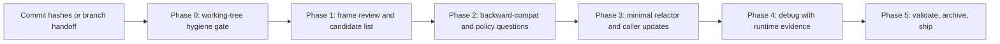

# Minimal Feature Review

Symmetric counterpart to [.cursor/skills/minimal-feature-cycle/SKILL.md](../minimal-feature-cycle/SKILL.md): someone else just ran the cycle, you come in to review, debug what's off, and minimally refactor before shipping. The skill is six tight phases. Each phase has one job; do not blur them.

## Phase 0 — Working-tree hygiene gate

Run `git status` before any review work. If the tree has unrelated pre-existing changes (other agent's WIP, mid-refactor renames, untracked configs), commit them as one `chore: <one-liner>` commit first. Do not start the review on a mixed tree.

Why: the focused review commit then stands alone, and any later `git pull` or merge resolves against a clean base. Skipping this is the one mistake that turned a one-conflict pull into a six-conflict pull during the worked example.

The user named this lesson explicitly: *"we should have just committed the unrelated file moves first before running our thing"*. Do not repeat it.

After the review commit: if backlog rows or process changed, run [learn-skill](../learn-skill/SKILL.md) or update `backlog.xlsx` via [pm-backlog-review](../pm-backlog-review/SKILL.md) — not `backlog.md` alone.

If the working tree is already clean, note it and proceed.

## Phase 1 — Frame the review

Inputs are usually commit hashes, a feature branch, or a handoff message ("the other agent just finished X"). Establish what changed and what looks wrong:

- `git show <hash> --stat` for each named commit.
- Read the diff of the 2-3 files that look most likely to carry waste (new types, new helpers, new tests with hardcoded data).
- Build a candidate list of cleanup targets. The recurring smells:
  - Duplication between a notebook helper and a production helper that does the same thing.
  - Over-typed dataclass used in exactly one call site where a tuple suffices.
  - Hardcoded Python list/dict of test data that should be a JSON fixture.
  - Datetime/format parsing that has not been exercised against the real OCR/external input shape.
  - Dead code (legacy helpers, commented-out blocks, stale conditional branches).

Surface the top 2-3 targets to the user **with the assumptions you read into the code** for explicit confirmation. Do not start planning the refactor until those assumptions are confirmed.

## Phase 2 — Constrained clarifying questions

Per [.cursor/rules/planning-clarifying-questions.mdc](../../rules/planning-clarifying-questions.mdc) and [.cursor/rules/planning-backward-compatibility.mdc](../../rules/planning-backward-compatibility.mdc), one batched AskQuestion round covering:

- **Backward compatibility**: none / partial / strict. Default to none for review work unless the change has external callers the user named.
- **Semantic policy gaps** the review surfaced: e.g. silent fallback vs warn-and-fallback for a datetime parse failure.
- **Adjacent artefact scope**: notebook produced by the cycle — keep as evidence, rerun for parity, or archive.

Do not start coding until the answers land.

## Phase 3 — Minimal refactor

The shape that removes the waste in the fewest lines. Update callers (notebooks, tests, sibling modules) in the same commit so the API rename lands atomically.

Concrete patterns from the worked example:

- 5-field dataclass used in one call site -> plain tuple return.
- Hardcoded `FIXTURES = [...]` Python list of dicts -> dynamic loader reading `*.json` files from the canonical fixture directory.
- `UTC+2` reaching `dateutil.parser.isoparse` with POSIX semantics (gives -2 hours) -> normalise to ISO `+02:00` first.

Track net line count honestly. If the "cleanup" ends up net-positive, ask whether the simplification is actually warranted before continuing.

## Phase 4 — Debug what doesn't work

Reuse [.cursor/skills/minimal-feature-cycle/SKILL.md](../minimal-feature-cycle/SKILL.md) Phase 4 (root-cause discipline) and Cursor Debug mode (hypotheses -> instrumentation -> cited evidence). Do not re-state that loop here.

Review-specific note: when a notebook crashes after you have edited code on disk, confirm with `git show HEAD:<path>` (or `git diff HEAD <path>`) that the file actually carries your change before suspecting the code. The most common false positive in this skill's loop is a stale Jupyter kernel holding the pre-edit module in `sys.modules`. The fix is kernel restart, not a code change.

## Phase 5 — Validate, archive, ship

- Targeted pytest run: only the modules touched by the refactor. Reuse the existing test suites; do not invent new tests unless the review surfaced an uncovered failure mode.
- Human UX walkthrough per [.cursor/rules/post-implementation-human-ux-review.mdc](../../rules/post-implementation-human-ux-review.mdc) where there is a visible surface (CLI output, notebook artefact, report). Otherwise record `Human UX review: N/A — <one-line reason>` in the plan.
- Move plan and notebook through stages per [.cursor/rules/plans-lifecycle-workflow.mdc](../../rules/plans-lifecycle-workflow.mdc).
- One production-ready commit staging only the focused files. Working-tree noise should already be on its own Phase 0 commit.

## Flow

## Pointers

- Patterns and smells in depth: [reference.md](reference.md).
- One worked example from this repo: [examples.md](examples.md). Read on request.
- Related skill (the cycle being reviewed): [.cursor/skills/minimal-feature-cycle/SKILL.md](../minimal-feature-cycle/SKILL.md).
- After authoring or installing this skill, consider running [.cursor/skills/new-skill-integration/SKILL.md](../new-skill-integration/SKILL.md) to sweep always-applied rules this skill subsumes.
