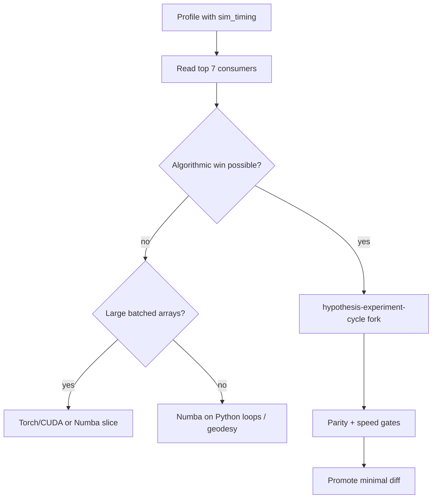

# Performance Optimization

Measure first, optimize what the profile proves is slow, and keep production kernels clean until a hypothesis is supported.

## Use when

- Simulation or training feels slow (`steps/s`, episode wall time, notebook tqdm).
- Before choosing **Numba**, **Cython**, or **CUDA/GPU**.
- Before large refactors (game engine, parallel envs, kernel rewrites).
- Closing a **performance-driven** promotion from `hypothesis-experiment-cycle`.

## When this is overkill

Not every path needs game-engine throughput. If the user states a loose budget (e.g. “runs once a day, 30 s is fine”), confirm the budget, run a quick profile only when unclear, and avoid heavy optimization.

## Workflow



1. **Baseline profile** — run `sim_timing` (see below) on the scenario that hurts (e.g. high cloud count).
2. **Interpret bins** — rank by `total_s` and `pct_of_sim_loop`; read `per_step_ms` for step budgets.
3. **Hypothesize one change** — use `hypothesis-experiment-cycle` (fork, JSON contract, analysis card).
4. **Re-profile** — same fixture; compare `steps_per_s` and category deltas.
5. **Promote** — only after parity + speed gates; follow performance promotion checklist in that skill.

## Canonical profiler (this repo)

| Item | Path |
|------|------|
| Experiment | `backend/scripts/experiments/sim_timing/` |
| CLI | `run_profile.py` |
| Hooks | `_hooks.py` (install / uninstall monkey-patches) |
| Report | `results/{scenario}_timing.json`, `.md` |

**Run** (repo root, PowerShell; env **ASC** per `python-runtime-environment`):

```powershell
conda activate ASC; python backend/scripts/experiments/sim_timing/run_profile.py
conda activate ASC; python backend/scripts/experiments/sim_timing/run_profile.py --scenario high_cloud
conda activate ASC; python backend/scripts/experiments/sim_timing/run_profile.py --scenario high_cloud --with-render
```

Scenarios: `low_cloud` (5–6 clouds), `high_cloud` (notebook-scale 50–200 bounds, frozen pickle). Fixtures reuse `sensor_ray_batch/_frozen_baseline.py`.

### Timing categories (binned)

| Key | User-facing bin |
|-----|-----------------|
| `controller_actuator` | Controller / policy (actuator command) |
| `robotics_dynamics` | Reaction wheel & attitude dynamics |
| `orbit_kinematics` | Orbit XY lookup (precomputed ephemeris) |
| `environment_clouds` | Cloud arc / meteo encoding |
| `sensor_camera_rays` | Camera ray kernel |
| `geodesy` | Disk ↔ geodetic transforms |
| `footprint_target` | Target footprint overlap & novelty |
| `reward_ml` | Reward / ML-side scoring |
| `stepper_bookkeeping` | Residual per-step overhead |
| `render` | Render setup & frame draw |
| `export_video` | MP4 encode |

Report includes **top 7 consumers**, `steps_per_s`, `per_step_wall_ms`, and `unaccounted_in_loop_s`.

Full notes: [reference.md](reference.md).

## Rules

- **Do not** add permanent timing code to production `simulation/*` or `render/*` during investigation; extend `sim_timing` or a new experiment slug.
- **Do not** treat render FPS as simulation `steps/s`; export/render are optional (`--with-render`).
- **Patch import bindings** when monkey-patching: modules that did `from X import Y` keep a stale `Y` unless you also set `that_module.Y = patched` (see `sim_timing/_hooks.py`).
- **Orbit propagation** is precomputed in the stepper; only lookup is timed under `orbit_kinematics`.
- Prefer **algorithmic** wins (precompute arcs over time, FOV cull, batch timesteps) before compilers or GPU.
- **GPU** pays off when batching many timesteps or envs; per-step ~400×N_cloud rays is often too small for launch overhead alone.

## Technology choice (after profile)

| Profile shows | Try first |
|---------------|-----------|
| `environment_clouds` dominates | Precompute `(n_frames, n_clouds)` arc specs once per episode |
| `sensor_camera_rays` dominates | Fused rays, tensor cloud×ray (see `sensor_ray_batch`) |
| Python loops in geodesy | Numba on hot functions (float64 arrays, no pint in `@njit`) |
| Huge batched arrays, training throughput | PyTorch CUDA on batched rollout; keep NumPy parity path |
| Need C ABI / Numba fails | Cython (last resort before raw CUDA) |

## Extending the profiler

Copy `sim_timing/` layout for another domain:

```text
backend/scripts/experiments/<slug>/
  _timing_collector.py   # categories + top-N report
  _hooks.py              # install / uninstall only
  _profile_runner.py
  run_profile.py
  results/
```

Add categories only when they map to a real subsystem; keep top-N at 7 unless the user asks otherwise.

## Related skills

- [`hypothesis-experiment-cycle`](../hypothesis-experiment-cycle/SKILL.md) — fork, parity, promote performance hypotheses.
- [`python-runtime-environment`](../python-runtime-environment/SKILL.md) — conda env **ASC** (always before Python)
- [`implementation-discipline`](../implementation-discipline/SKILL.md) — small verified slices when promoting.

## Reference results (high_cloud, 63 clouds)

Illustrative profile after hooks fixed import bindings:

| Rank | Category | ~% of sim loop |
|------|----------|----------------|
| 1 | Cloud arc encoding | ~77% |
| 2 | Camera ray kernel | ~15% |
| 3 | Reward | ~3% |

Re-run `run_profile.py` after code changes; do not rely on stale numbers.
